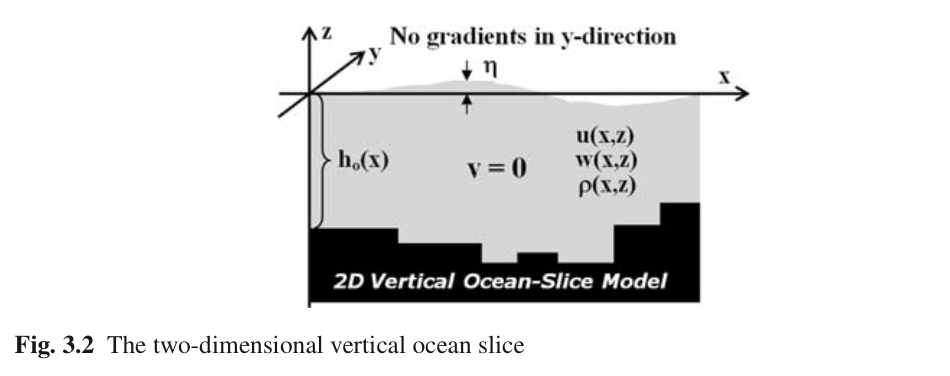

#Ch3. Basics of Nonhydrostatic Modelling

本章将介绍NS方程非静压有限差分算子。本章只研究海洋二维垂向切面，垂直于这个平面的流动和梯度都为0，科氏力也忽略。练习强调深海中重力波、底部密度驱动流、内波、垂向剪切流不稳定性、lee wave、双扩散不稳定性，双扩散分层和自由对流。

##3.1 分层模型

##3.2 2维垂向模型

###3.2.1 模型设置

考虑2维垂向海洋断面模型，z轴指向正上方，x轴为水平方向。自由表面为$z = \eta$，海底高程为$z = -h_0$。假设垂直于这个截面的运动和梯度都是不存在的，这代表忽略科氏力。

###3.2.2 Arakawa C网格

##3.3 自由表面波

###3.3.1 控制方程

平面波是单向波，波峰线和波谷线垂直于传播方向。平面重力波在均匀密度流体中沿着x轴传播，可以通过Navier-Stokes方程表示：

$$\begin{eqnarray}
\begin{aligned}
& \frac{\partial u}{\partial t} = -\frac{1}{\rho_0} \frac{\partial P}{\partial x}
& \frac{\partial w}{\partial t} = -\frac{1}{\rho_0} \frac{\partial P}{\partial z}
& \frac{\partial u}{\partial x} + \frac{\partial w}{\partial z} =0 
\end{aligned}
\end{eqnarray}$$

简单起见，非线性项即摩擦作用都已经忽略。

海洋自由表面控制方程可表示为体积守恒方程

$$\begin{equation}
\frac{\partial \eta}{\partial t} = - \frac{\partial (h \langle u )}{\partial x}
\end{equation}$$