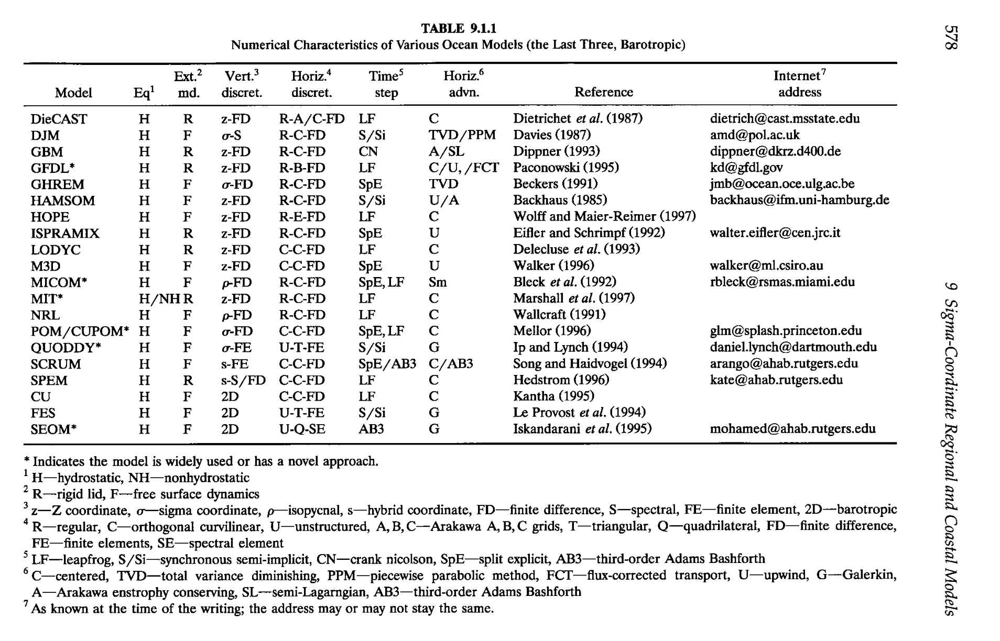

>Book [Kantha_2000] Numerical Models of Oceans and Oceanic Processes [9]

#第9章 Sigma坐标区域与近岸模型

Haidvogel 和 Beckmann（1997）在最近的综述中讨论了近海海洋建模的研究。在他们的论文中，如表9.1.1所列，提供了大部分适用于近岸模拟的各种海洋模型的特性的简明介绍。这些模型求解方法多种多样，都是求解基本的三维Boussinesq近似的原始方程。它们包括静压和非静压两种：z-坐标（z-level），$\sigma$ 坐标，s 坐标（混合坐标），等密度坐标方程组；刚盖假定与自由表面假定；水平结构化网格与非结构化网格；Arakawa A，B，C 变量交错方式；有限差分，谱方法，有限元，谱单元方法；显式（蛙跳格式，三阶 Adams-Bashforth），半隐式，模分离，还有隐式 Crank-Nicolson 时间递进格式；中心二阶格式，一阶迎风格式，三阶 Adams-Bashforth，TVD，通量修正传输（FCT），逐段抛物线方法（PPM）以及其他对流格式（参考Ch2）。数值模型的表现在很大程度上取决于在其作出的特定选择。不幸的是，很少有对这些方法选择及选择方法的影响进行系统的研究（只有Haidvogel 和 Beckmann 1997），并且因此难以使对于特定问题提出合适并且详细的建议，但也有一些一般准则可以给出。在下面，我们尝试
提供构成一个近岸模型的理由并且大体上讨论下其应用范围。这也碰巧是我们所熟知的。

##9.1 简介

一般来说，考虑到复杂的海岸线和地形，结构化网格是缺少灵活性的沿海海洋模拟方法，即使正交曲线坐标提供了更多的灵活性和嵌套（nesting）减轻这个问题。非结构化网格（有限元）提供基本上是无限制的灵活性，可以使模型网格任意接近复杂的海岸线形状，但也有一些计算和数值上不利因素。在大多数情况下，刚盖假定不能应用在浅水海域，因此自由表面运动过程应包括在内。这意味着，模式分离求解技术应该被使用，以避免在所有方程的计算上昂贵的解决方案由外部重力波CFL条件（尽管需要时间滤波以抑制弱的不稳定可能导致分裂的时间步说，见下文）规定小的时间步骤。提取最大效率，更耗时内部模式方程求解频率低于所述外部模式的方程，具有这两种模式在仔细处理偶联时间工序之间的相互作用。另一种方法是同步的半隐式配方，把引力波产生涉及SSH梯度在外部和内部模式方程和连续性方程半隐式（Haidvogel和贝克曼，1998）相关条款条款。这使得两个方程与较大的时间步骤来解决，但代价是需要求解一组椭圆方程在每个时间步长（类似于刚盖制剂）。交错荒ç电网通常是因为其可以接受的引力波的传播特性选择的网格在沿海水域中通常使用的高格决议。