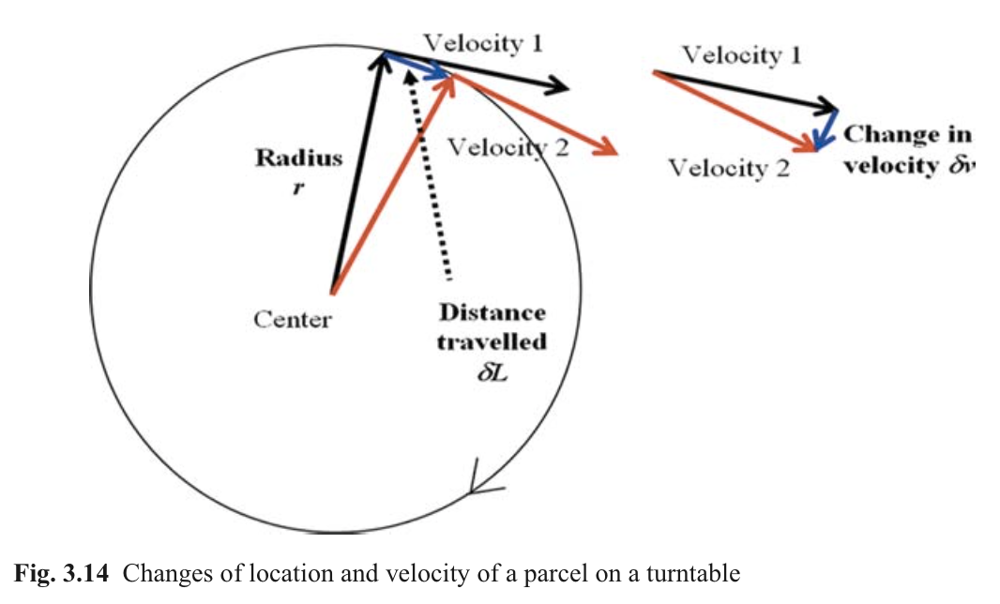
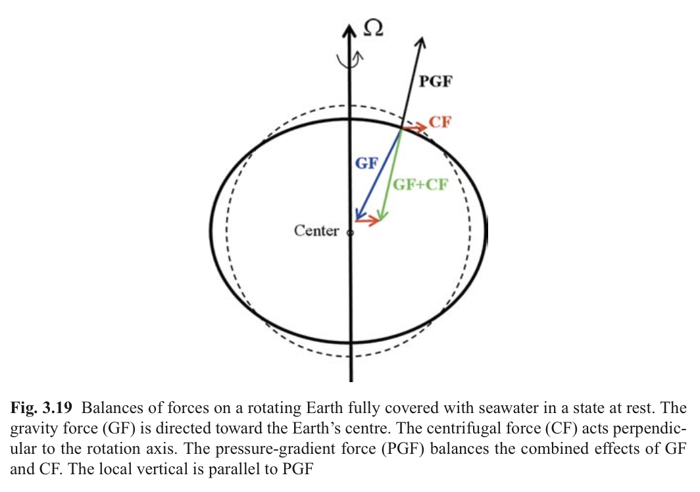
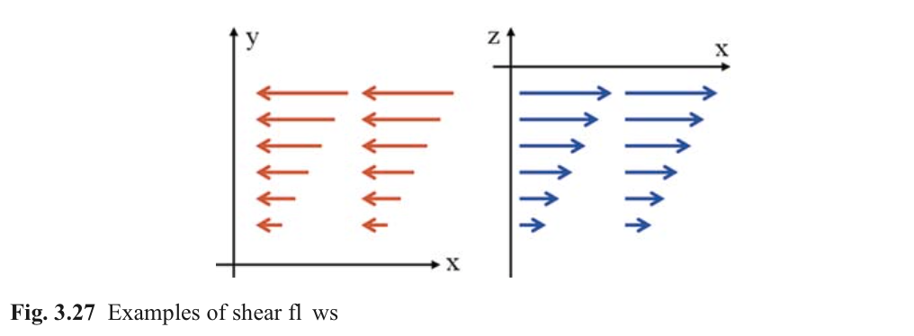

#Ch3. Basics of Geophysical Fluid Dynamics
第三章目录

[TOC]

本章主要介绍

1. 标量与向量
2. Newton定律
3. 波动与恒定状态流体
4. 浮力
5. 科氏力
6. 守恒律
7. 紊动
8. N-S方程

##3.1 Units

micro ($\mu$) = 10−6 = 0.00001 
milli (m) = 10−3 = 0.001 
centi (c) = 10−2 = 0.01 
kilo (k) = 103 = 1000

##3.2 Scalars and Vectors

##3.3 Location and Velocity

##3.4 Types of Motion

###3.4.1 恒定状态运动

恒定状态就是*不随时间变化的流动状态*。这代表了流体内所有作用力维持平衡状态。

###3.4.2 Waves

波动是另一种随时间和空间的运动形式。不同波可以根据波长与周期进行分类。其中波长为两个波峰之间距离，波周期是连续两个波峰或波谷通过的时间间隔。

###3.5.8 Phase Speed

###3.5.9 Dispersion Relation

波长与周期通常不是相关的，尽管如此，波长与周期之间关系通常称色散关系（dispersion relation）。

###3.5.10 波的叠加（Superposition）

干涉波的模式以一定的速度行进，称之为群速

##3.6 练习 2: 波的干涉

##3.7 力

##3.8 守恒律基础

1. 动量守恒
2. 质量守恒
3. 内能守恒
4. 盐度守恒

状态方程是描述盐度、温度与密度之间关系公式

##3.9 重力与浮力

###3.9.3 稳定频率

垂向密度梯度可以写成稳定频率$N$的形式，其表达式为
$$N^2 = -\frac{g}{\rho_0}\frac{\partial \rho}{\partial z}$$
其中$\rho_0$为平均密度。

###3.10 练习 3: 浮体的振动

##3.11 压力梯度力

###3.11.1 静水平衡

*静压平衡*或*静水假设*，可以表达为

$$0 = -\frac{1}{\rho}\frac{\partial P}{\partial z} -g$$

###3.11.3 海洋中静压场

海洋中静水压力有三个组成部分：大气压，海表面提升或降低引起的压力变化，由于海洋中密度层化引起的压力变化。
大气压力对水平梯度没有任何影响，海表面会瞬间调整至大气压力的变化，使得该海面下的压力保持大致相同。这被称为反相气压计效应。

###3.11.4 海洋中压力动力

海洋中垂向静压分布为

$$P(z^\*) = \rho_0 g \eta + g\int^\eta_{z^\*} \rho'dz$$

其中$z^\*$为在水柱中的垂向位置，\eta为水面高程。
去除掉无关的压力贡献，静压关系写为：

$$0 = -\frac{\partial P}{\partial z} - \rho'g$$

###3.11.5 水平压力梯度

控制水体运动的主要作用力之一就是水平压力梯度。这个力由于倾斜的水平面或者水平密度梯度产生，压力梯度水平部分为：

$$-\frac{1}{\rho}\frac{\partial P}{\partial x}  \quad \text{and} \quad -\frac{1}{\rho}\frac{\partial P}{\partial y}$$

###3.11.6 Boussinesq假定

海水中密度变化与平均密度相比小于1%，因此，水平压力梯度可近似为

$$-\frac{1}{\rho_0}\frac{\partial P}{\partial x}  \quad \text{and} \quad -\frac{1}{\rho_0}\frac{\partial P}{\partial y}$$

###3.11.7 均匀密度

在均匀密度的流体中，水平压力梯度为

$$-g\frac{\partial \eta}{\partial x} \quad \text{and} \quad -g\frac{\partial \eta}{\partial y}$$

可以令$\rho'=0$代入垂向压力表达式中。在灭幼压力变化情况下，整个垂向水柱中水平压力都是相同的。我们可以预期整个水流也是与垂向无关的运动，即正压流动。而压力梯度在海洋内部变化的流动为斜压流动。图3.11描述了两种流动状态。

##3.12 科氏力

###3.12.1 表面力

在旋转坐标系中，物体的直线运动在外部看来是一条曲线，两种力与这种运动相关，分别是离心力与科氏力。

###3.12.2 向心力与离心力

物体固定在绳子的一端，绕着某点旋转，在外部看来物体运动轨迹为圆形，这个阻止物体沿直线运动的力为向心力。向心力指向轨迹的圆心，与运动方向垂直，公式为：

$$\text{Centripetal force}=-\Omega^2 r$$

$r$为物体运动轨迹半径，$\Omega=2\pi/T$为旋转角速度。定义旋转逆时针为正，顺时针为负。
在旋转坐标系内观察，物体是静止不动的。因此，向心力一定由另一个大小相等，方向相反的力平衡，这个力就是离心力，离心力公式为：

$$\text{Centrifugal force}=+\Omega^2 r$$

松开绳子后，在旋转坐标系内观察这个物体讲座曲线运动。

###3.12.3 向心力得出

如图3.14中，根据三角形相似可以得$\delta v/v = \delta L/r$，其中$\delta L = vdt$，因此，向心力大小为

$$\frac{dv}{dt} = -\frac{v^2}{r}$$

###3.12.4 旋转流体中的离心力

考虑在一个旋转圆筒内装满水，让圆筒持续以一个常角速度转动，所有流体最终达到与圆筒相同的角速度。在这种恒定状态下，流体表面达到凹凸平面。最终形状由离心力与向心力平衡决定，在流体中由水平压力提供。平衡方程为：

$$-g\frac{\partial \eta}{\partial r} = -\Omega^2 r$$

这里$r$为圆筒半径。最终自由面解析解为

$$\eta(r) = \frac{1}{2}\frac{\Omega^2}{g}r^2-\eta_0$$

###3.12.5 在固定坐标系中观察旋转流体

当以固定坐标系作为参考系时，*流体颗粒只受到压力梯度产生的向心力作用*。当我们给颗粒一个初始速度后会如何？动量方程为：

$$\frac{dU}{dt} = -\Omega^2 X \quad \text{and} \quad \frac{dV}{dt} = -\Omega^2 Y$$

其中，$(X,Y)$为位置坐标，$(U,V)$为固定坐标系中速度。

###3.12.6 颗粒轨迹

###3.12.8 解析解

###3.12.9 科氏力

我们把固定坐标系内的轨迹转换到旋转坐标系内，便可得到科氏力。坐标转换关系为

$$\left[ \begin{array}{ll}
x \cr
y
\end{array} \right]=
\left[ \begin{array}{ll}
cos(\Omega t) &  sin(\Omega t)\cr
-sin(\Omega t) &  cos(\Omega t)\cr
\end{array} \right]
\left[ \begin{array}{ll}
X \cr
Y
\end{array} \right]$$

坐标转换后颗粒轨迹为圆形，当圆筒转一周时颗粒恰好沿圆形轨迹运动两周。因此，$0.5T$称之为惯性周期，此运动为惯性振荡。$T$为圆筒旋转周期。

相较使用固定坐标系，使用旋转坐标系更加方便，在观察者眼中，物体不受其他力作用，惯性振荡由动量方程控制：

$$\frac{\partial u}{\partial t} = +2\Omega v \quad \text{and} \frac{\partial v}{\partial t} = -2\Omega u\quad $$

科氏力与运动方向垂直，系数2反映了惯性振荡的周期为旋转参考系转动周期的一半。

##3.13 地球上的科氏力

###3.13.1 局部垂向

在旋转流体平衡状态时，流体自由表面的离心力由压力梯度提供。在旋转地地球上，这导致重力的略微变化（不超过0.4%）。任何地理坐标处的局部垂向定义为与平衡海洋表面垂直的方向，这也意味着，在平衡状态，压力梯度力与科氏力和重力平衡分力是平衡的。

###3.13.2 科氏力系数

科氏力与维度相关，表达式为：

$$\frac{\partial u}{\partial t} = +f v \quad \text{and} \frac{\partial v}{\partial t} = -f u\quad $$

其中$f = 2\Omega sin(\phi)$（$\phi$为维度）称为科氏力系数。科氏力系数在南半球和北半球交换正负符号，在极点为0。

###3.13.3 f-平面近似

如果平面尺度为100km，那么科氏力系数可以使用一阶近似。我们可以让平面坐标轴z向指向局部垂向方向，并且使用科氏力系数为常数。常系数$f$使用原点处科氏力系数。这种近似称为*$f$-平面近似*

###3.13.4 $\beta$-平面近似

当水平尺度达到1000km时，这时科氏力系数采用如下公式：

$$f = f_0+\beta y$$

其中$\beta$为科氏力变化系数，大小为$\beta = 2.2 \times 10^{-11} m^{-1}s^{-1}$，$y$为距离笛卡尔坐标原点的距离，单位为米。注意当坐标点位于原点南方时$y$为负值。这种近似公式称为$\beta$-平面近似。

##3.14 练习4：科氏力作用

##3.15 紊动

###3.15.1 层流与紊流

层流是光滑流动形式不展现任何不稳定运动形态。

###3.15.2 雷诺近似

将我们观察的物理量写成平均值与波动值组合形式

$$\psi = \left \langle \psi \right \rangle + \psi'$$

###3.15.3 引起紊动原因

1. 剪切流
由于摩擦作用，剧烈的剪切流容易在流体边壁附近出现
2. 不稳定垂向密度层化导致对流混合
稳定的层化可以抑制紊动

###3.15.4 Richardson数

层流与紊流的界定可以通过无量纲数（Richardson数）来判断。这个数比较垂向密度层化与垂向剪切流两种作用下紊动能量的产生与耗散。表达式为：

$$R_i = \frac{N^2}{(\partial \left \langle u \right \rangle/ \partial z)^2}$$

其中$N^2$为周围密度场的稳定频率（the stability frequency）。理论与研究表明，当$R_i$小于0.25时产生紊动。

###3.15.5 紊动闭合与紊动扩散

###3.15.6 Prandtl 混合长度

垂向剪切流是紊动一个来源。假如没有密度层化时，垂向混合系数$A_z$正比与流速在垂向变化率大小，关系式为：

$$A_z = L^2 \left| \frac{\partial u}{\partial z} \right|$$

其中$L$为Prandtl混合长度，代表紊动涡的直径。上面方程是紊动闭合模型的简化，需要知道涡的大小。更精确的紊流闭合模型包括了密度层化的影响，这时候还和Richardson数相关。

###3.15.7 扩散方程的表达

##3.16 N-S方程

###3.16.1 方程完整的设置

###3.16.2 海洋方程边界条件

风应力在海表面是一种摩擦力。对应的边界条件为：

$$\left( A_z \frac{\partial u}{\partial z} \right)\_{z=0} = \frac{\tau^{wind}\_x }{\rho_0} \quad \text{and} \quad \left( A_z \frac{\partial v}{\partial z} \right)\_{z=0} = \frac{\tau^{wind}\_y }{\rho_0}$$

这里$\rho_0$为表面处密度。风应力大小为：

$$\tau^{wind}\_x = \rho\_{air} C_d U \sqrt{U^2 + V^2} \quad \text{and} \quad \tau^{wind}\_y = \rho\_{air} C_d V \sqrt{U^2 + V^2}$$

其中$C_d$为无量纲的拖曳力系数，大小为$1.1\approx 1.5\times 10^{-3}$，$U$ 和 $V$ 为海面10m处风速。

底部摩擦力通常采用线性或二次近似条件。线性近似表达式为

$$\frac{\tau\_x^{bot}}{\rho_0} = \left( A_z \frac{\partial u}{\partial z} \right)\_{z=-H}=r_{lin}u \quad \text{and} \quad \frac{\tau\_y^{bot}}{\rho_0} = \left( A_z \frac{\partial v}{\partial z} \right)\_{z=-H}=r_{lin}v$$

这里$H$为水深，摩擦系数$r_lin$单位为$ms^{-1}$，$(u,v)$为底床附近的流速大小。二次表达式为：

$$\frac{\tau\_x^{bot}}{\rho_0} = r u \sqrt{u^2 + v^2} \quad \text{and} \quad \frac{\tau\_y^{bot}}{\rho_0} = r v \sqrt{u^2 + v^2}$$

其中$r$为无量纲的底部切应力系数

##3.17 比尺

###3.17.1 目的

###3.17.2 示例

