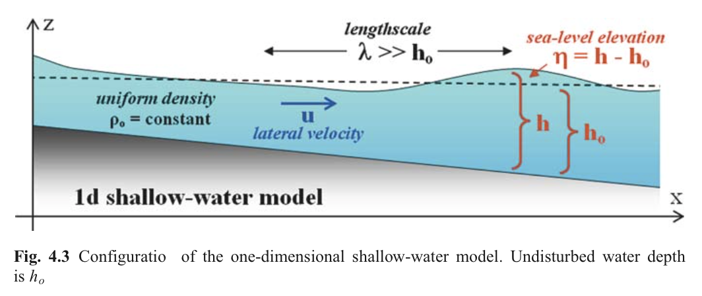
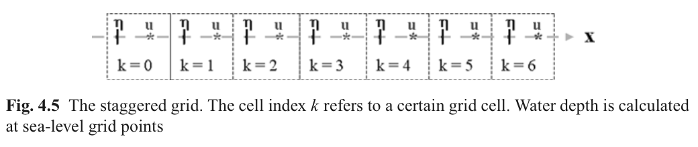
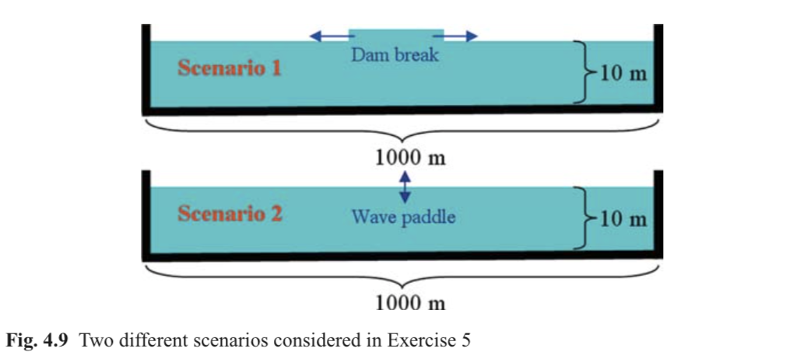
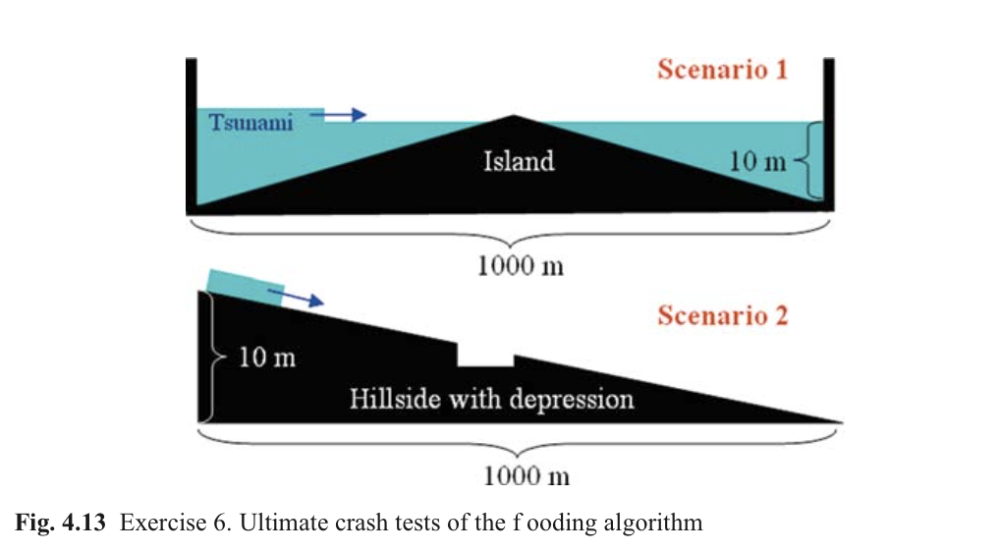
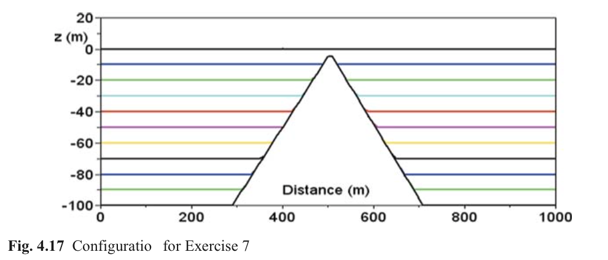

#Ch4. Long Waves in a Channel

[TOC]

**简介**

本章主要介绍明渠中分层流体模拟。练习包括浅水表面波，风暴潮、内波和分层流体模拟。

##4.1 有限差分法详细介绍

###4.1.1 泰勒公式

###4.1.2 前差，后差，中心差分

###4.1.3 二阶微分格式

###4.1.4 截断误差

考虑函数：

$$f(x) = A sin(2\pi x/\lambda)$$

方程的导数为：

$$\frac{df}{dx} = 2 \pi A/ \lambda cos(2 \pi x/lambda)$$

如果我们使用中心差分近似一阶导数，可以得到

$$\frac{f(x+\Delta x) - f(x-\Delta x)}{2 \Delta x} = \frac{A sin[2 \pi (x+\Delta x) / \lambda] - A sin[2 \pi (x-\Delta x) / \lambda]}{2 \Delta x} = 2 \pi A / \lambda cos(2 \pi x / \lambda) \cdot [1-\epsilon]$$

相对误差与绝对误差的比值

$$\epsilon(\Delta x) = 1-\frac{sin(2 \pi \Delta x/ \lambda)}{2 \pi \Delta x / \lambda}$$

使用有限差分法模拟波动过程时，只有波长范围内有10个以上节点时才能准确描述波动过程。

##4.2 表面重力长波

###4.2.1 单个过程分析

NS方程描述了在不同长度尺度和时间尺度上同时发生的流体运动过程。在某些假定下，我们可以取出单独过程进行研究。比如说，当周期远远小于惯性周期时，我们可以忽略科氏力的作用而对控制方程进行简化。

###4.2.2 浅水过程

###4.2.3 浅水模型

我们做以下假定：

1. 波周期相比惯性周期很小，可以忽略科氏力作用
2. 假设摩擦力为一阶近似
3. 忽略非线性项，即波速远远超过颗粒运动速度

###4.2.4 控制方程

###4.2.5 波动解析解

###4.2.6 动画演示

###4.2.7 数值计算网格

使用交错网格，流速节点位于相邻水位节点中间。

###4.2.8 有限差分格式

###4.2.9 稳定准则

CFL准则：

$$\lambda = \frac{\Delta t}{\Delta x}\sqrt{g h_{max}} \le 1$$

其中$h_max$为模型中最大水深。

###4.2.10 一阶Shapiro过滤器

为了去掉数值振荡现象，使用Shapiro过滤算子（Shapiro, 1970）：

$$ \eta\_k^{n+1} = (1-\epsilon)\eta\_k^\* + 0.5 \epsilon (\eta\_{k-1}^\* + \eta\_{k+1}^\*) $$

其中$\epsilon$为光滑系数。

###4.2.11 陆地与海岸边界

没有流动可以穿过陆地与海岸线，除非特殊处理的计算格式（4.4节介绍）。由于交叉网格设置，海岸线需要特殊的条件，若$h_{k+1}\le 0$时$u_k$为0。

###4.2.12 侧向陆边界条件

模型计算网格从$k=1$到$k=nx$，边界处单元$k=0$与$k=(n+1)x$也需要赋值才能计算。一种方法是令边界闭合，横向对流流速为0：

$$u_0^n = 0 \quad \text{and} \quad u_{(n+1)x}^n = 0\quad $$

*0梯度边界条件*用来消除物理量在边界处扩散流量，边界条件为：

$$C_0^n = C_1^n \quad \text{and} \quad C_{(n+1)x}^n = C_{nx}^n\quad $$

*周期边界条件*表示为：

$$C_0^n = C_{(n+1)x}^n \quad \text{and} \quad C_{(n+1)x}^n = C_1^n\quad $$

###4.2.13 模块化Fortran脚本

###4.2.14 Fortran代码结构

##4.3 练习5：明渠中长波运动

###4.3.1 目标

###4.3.2 说明

水渠长1km，网格步长10m，设置101个节点单元，包括最后一个边界节点，计算时间步长0.1s，满足CFL准则。

1. 溃坝算例
平衡状态水深为10m，在中心110m宽长度上初始高程提升1m
2. 波动算例
在中点处放置一个造波板，以1m振幅，20s周期造波

###4.3.3 简单代码及动画示例

###4.3.4 结果

##4.4 练习6： 干湿算法

###4.4.1 目标

可以模拟洪水传播到陆地过程。例如由潮水或风暴潮淹没海岸情形。

###4.4.2 重新定义干湿

湿节点定义为水深超过某一阀值$h_{min}$，通常为几厘米左右。这个阀值作用主要是避免水体退去后湿单元出现负水深，从而使模型崩溃。干单元通常定义为$h\le h_{min}$

###4.4.3 淹没干单元

###4.4.4 淹没边坡

1. $h_0$为静水位置距底部距离，在有水地方为正值，而在陆地为负值
2. 初始高程在湿单元处为0，在干单元与陆地高程相同$\eta = -min(0, h_0)$
3. 真正水深为$h = h_0 + \eta$，这个水深用来判别干湿节点

###4.4.5 终极测试（？Ultimate Crash Tests）

两组测试算例，长1km，网格步长10m，设置101个节点单元，前后增加一个边界节点，计算时间步长0.1s，满足CFL准则。

1. 小岛最高位于水面0.5m，左侧200m有一风暴潮，初始高程1m，两侧为陆边界
2. 斜坡上有一高程为4m水坑

代码几处要点

1. 过滤算子只在湿节点作用，跳过干节点
2. 流速更新只考虑两种情形，两侧为湿节点；由湿节点流向干节点
3. 干湿阀值水深为0.1m，水深越小越精确（随着阀值减小，水体下流速度变快？）。但是此值不能为0，否则水体前进速度会变得特别快，并不符合实际。

存在问题

1. 干湿水深阀值如何确定？

##4.5 多层浅水模型

###4.5.1 基础

在浅水假定条件下，可以构造每一层都是密度为常数多层浅水模型。第i层的动量方程为

$$\frac{\partial u_i}{\partial t} = -\frac{1}{\rho_i} \frac{\partial P_i}{\partial x}$$

其中，$i$为层数，每层水体动压为

$$\begin{array}{ll}
P_1 = \rho_1 g \eta_1 \cr
P_2 = P_1 + (\rho_2 - \rho_1) g \eta_1 \cr
\cdots
\end{array}$$

更一般形式为

$$P_i = P_{i-1} + (\rho_i - \rho_{i-1})g \eta_i \quad \text{for} \quad i = 1,2,3,...$$

连续方程为

$$\frac{\partial h_i}{\partial t} = - \frac{\partial u_i h_i}{\partial x}$$

其中第i层水体厚度为

$$h_i = h_{i, 0} + \eta_i - \eta_{i+1}$$

这里$h_{i, 0}$为第i层水体未扰动时的厚度。

##4.6 练习7：长波在分层流体中运动

###4.6.1 目标

模拟重力波在不同密度分层水体内运动情况

###4.6.2 算例描述

顶层水体密度为$1025 kg/m^3$，第二层至底层密度分别从$1026 kg/m^3$到$1026.5 kg/m^3$逐渐增加。模型由左侧正弦振荡自由表面驱动，振幅为1s，周期分别为10s与2h。两侧为封闭的固边界。计算时间取10倍波动周期，时间步0.25s。

###4.6.3 代码

###4.6.4 结果

###4.6.5 内波相速度

在两层流体模型中，内部长波的相速度为：

$$c_{iw} = \sqrt{g'h^*}$$

这里$g'$为相对重力加速度，$h^* = h_1 h_2 /(h_1 + h_2)$为相对水深，对$h_2\gg h_1$时，$h*\approx h_1$。因此内部波运动速度远小于表面重力波，与表面重力波一样，在静压模型中，无法模拟内波破碎现象。

###4.6.6 封闭水体自由振荡

在波节点处，流体只进行水平运动而没有垂向运动。与之相反，在波腹处流体只有垂向运动。

###4.6.7 Merian 定律
###4.6.8 海湾内协同振荡（Co-oscillations）

