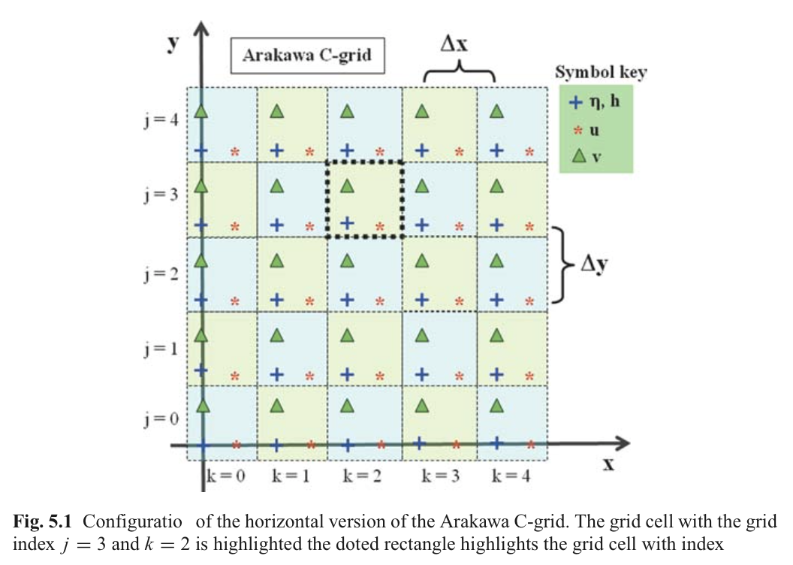
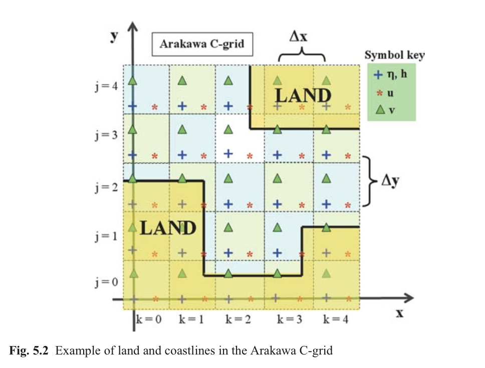
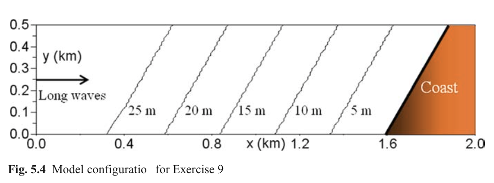
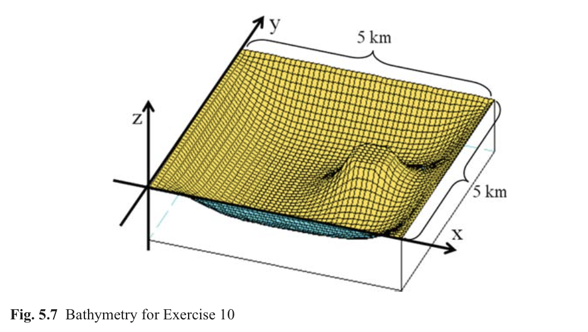
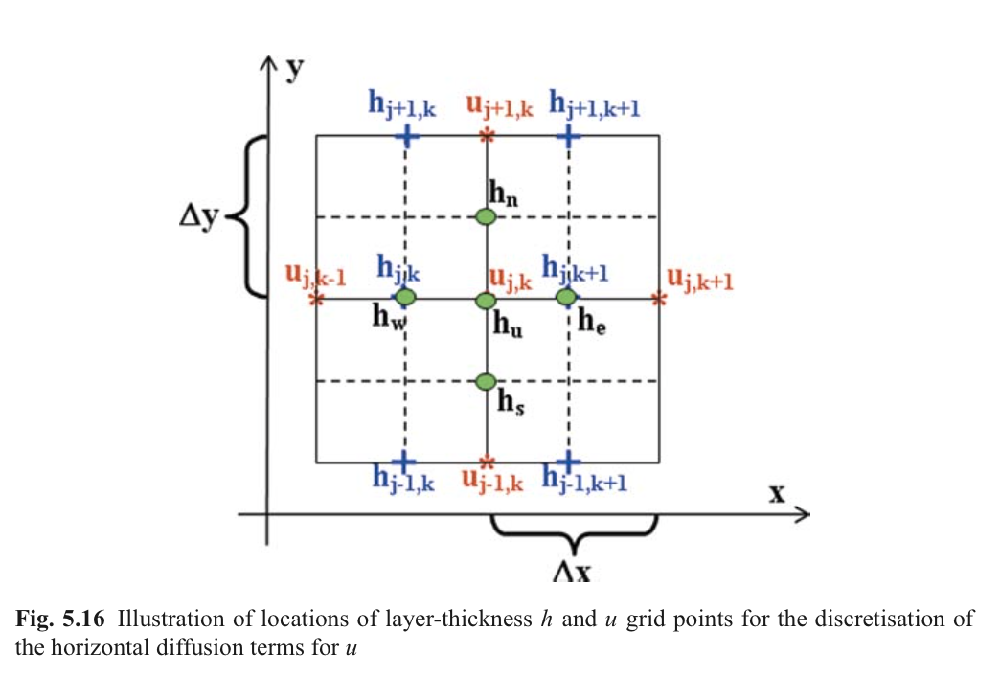
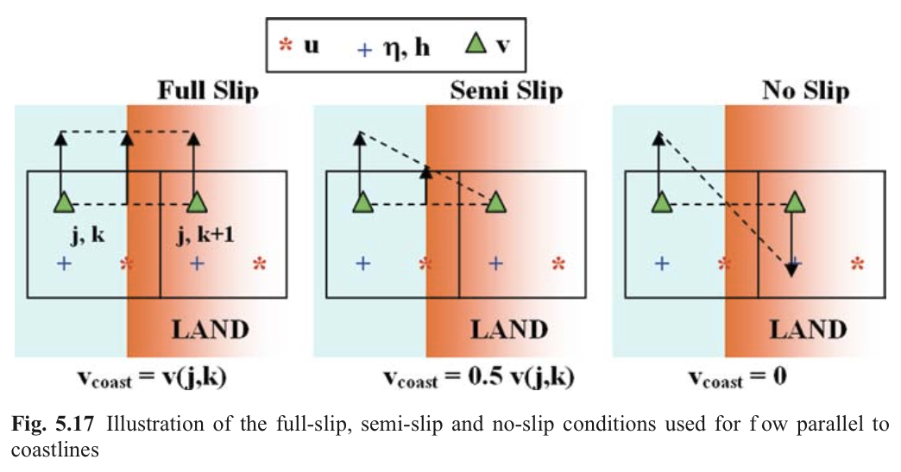

#Ch5. 2D Shallow-Water Modelling

[TOC]

本章利用二维浅水模型研究表面重力波的不同物理过程，如湖水中风驱动流体，正压不稳定机制（？the barotropic instability mechanism）。本章将为读者介绍使用不同的对流格式模拟物体运动轨迹和动量方程中非线性项。

##5.1 浅水中长波

###5.1.1 二维浅水波动方程

做以下假设：

1. 水体中密度为常数
2. 忽略底部摩擦
3. 忽略科氏力（周期与惯性周期相比非常小）
4. 忽略非线性项（波速远大于流体微团速度）

控制方程简化为

$$\begin{eqnarray}
\begin{aligned}
& \frac{\partial u}{\partial t} = -g \frac{\partial \eta}{\partial x} \cr
& \frac{\partial v}{\partial t} = -g \frac{\partial \eta}{\partial y} \cr
& \frac{\partial \eta}{\partial t} = -\frac{\partial (uh)}{\partial x} - \frac{\partial (vh)}{\partial y}
\end{aligned}
\end{eqnarray}$$

###5.1.2 Arakawa C网格

Arakawa C网格（Arakawa and Lamb, 1977）是一种交错网格形式，其中流速点分布在相邻水位点周围（如图5.1）。这种网格形式经常被海洋学模型所采用，也被后面模型网格形式。注意流速节点u，v并不在同一节点位置。

###5.1.3 有限差分方程

二维浅水方程离散格式，其中j为y方向单元序号，k为x方向单元序号。

$$\begin{equation}
\begin{aligned}
& u^{n+1}\_{j,k} = u^{n}\_{j,k} - \Delta t g(\eta^n_{j, k+1} - \eta^n_{j, k})/\Delta x \cr
& v^{n+1}\_{j,k} = v^{n}\_{j,k} - \Delta t g(\eta^n_{j+1, k} - \eta^n_{j, k})/\Delta y \cr
& \eta^*\_{j, k} = \eta^n_{j, k} - \Delta t \\{ (u^{n+1}\_{j,k} h_e - u^{n+1}\_{j,k-1} h\_w)/\Delta x - (v^{n+1}\_{j,k} h_n - v^{n+1}\_{j-1,k} h\_s)/\Delta y \\} 
\end{aligned}
\end{equation}$$

二维格式中一阶Shapiro过滤算子

$$\begin{equation}
\eta_{j,k}^{n+1} = (1-\epsilon)\eta_{j,k}^\* + 0.25 \epsilon(\eta_{j,k-1}^\* + \eta_{j,k+1}^\* + \eta_{j-1,k}^\* + \eta_{j+1,k}^\*)
\end{equation}$$

###5.1.4 陆地与海岸线

陆地定义为水深为0或者为负值，并且在模拟过程中流速分量恒为0。海岸线处隐式的设定法线方向流量为0。由于Arakawa-C网格的优势，这种方法可以按照以下两种情形设置，如果陆地在相邻节点东侧，那么该点u分量为0；同样的，如果陆地在相邻节点北侧，那么该点v分量为0。图5.2给出了在Arakawa-C网格中陆地和海岸线分布形式。干湿算法也可以类似按照一维情形处理。

###5.1.5 稳定性

$$\begin{equation}
\Delta t \le \frac{min(\Delta t, \Delta y)}{ \sqrt{2gh_{max}} }
\end{equation}$$

##5.2 练习8：浅水中长波

###5.2.1 目标

本练习目的是模拟环形表面重力波在二维平面上传播过程。

###5.2.2 任务描述

计算区域为 $500m \times 500m$ 矩形网格，空间步长为10m，全场水深为10m，四周为陆边界。

初始时刻在中心点有1m的初始水位，随着时间递进开始向四周传播形成环形波。时间步长为0.1s，共模拟100s

###5.2.3 代码范例

###5.2.4 计算结果

###5.2.5 附加练习

在计算网格内增加岛屿或者海底地形，观察表面重力波沿这些障碍物传播过程。

##5.3 练习9：波浪折射

###5.3.1 目标

本练习目的是预测平面重力长波在靠近浅水的近岸附近区域的动力特性。

###5.3.2 背景

为什么平面重力波在靠近海岸时总是平行于海岸线？原因就是由波浪折射引起。长波的相速度和总水深相关，在深水处波动传播比浅水处更快。因此波浪传播方向发生很大变化，最终平行于地形变化等深线。

###5.3.3 任务描述

计算区域2km长，500m宽，空间步长10m。总水深由左侧30m向近岸区域逐渐减小，海岸的坡度为每10m降低10cm。地形等深线和海岸线沿y方向旋转30°。一个单独的Fortran文件专门用来生成模拟计算时区域地形。
平面波是波峰线为直线并且相互平行的波动，传播方向垂直于波峰线并且可由相速度矢量表示。这个平面波在开边界左侧由自由表面正弦振荡形成，振荡周期为20s。

###5.3.4 侧向边界条件

##5.4 风驱动浅水模型

###5.4.1 控制方程

$$\begin{eqnarray}
\begin{aligned}
& \frac{\partial u}{\partial t} = -g\frac{\partial \eta}{\partial x} + \frac{\tau_x^{wind} - \tau_x^{bot}}{\rho_0 h} \cr
& \frac{\partial v}{\partial t} = -g\frac{\partial \eta}{\partial y} + \frac{\tau_y^{wind} - \tau_y^{bot}}{\rho_0 h} \cr
& \frac{\partial \eta}{\partial t} = -\frac{\partial (uh)}{\partial x} - \frac{\partial (vh)}{\partial y}
\end{aligned}
\end{eqnarray}$$

简化起见，动量方程中忽略了侧向摩阻，非线性项，科氏力等作用。这个模型只描述风驱动力和底部摩阻对垂向平均水体作用。

###5.4.2 底部摩阻半离散方法

假设仅受底部摩擦作用，并且使用二次阻力公式，动量方程写为：

$$\begin{equation}
\begin{aligned}
& \frac{\partial u}{\partial t} = -ru\sqrt{(u^2 +v^2)}/h \cr
& \frac{\partial v}{\partial t} = -rv\sqrt{(u^2 +v^2)}/h  \cr
\end{aligned}
\end{equation}$$

其中$r$为底部无量纲拖曳力系数。假设流动只沿着x方向，使用显式方法求解近似底部摩阻项，可得到差分方程：

$$\begin{equation}
u^{n+1}\_{j,k} = u^{n}\_{j,k}(1-\varepsilon) \quad \text{with} \quad \varepsilon=r\Delta \left| u^{n}\_{j,k} \right|/h_u
\end{equation}$$

其中$h_u$为u节点处水深。（注意CFL准则要求的是 $\left| u \right| \Delta t\le \Delta_h$，近岸附近水平网格尺度$\Delta_h$远大于水深$/h_u$）当$\varepsilon > 1$时就会出现问题，这时会驱动水流加速，这与实际底部摩阻作用结果是相悖的。使用半隐式格式可以避免出现此类问题，半隐式离散方程为：

##5.5 练习10：风驱流

###5.5.1 目标

本练习目的是在浅水变化地形上模拟风驱环流运动。

###5.5.2 变化地形建立

在模拟风驱流之前，首先向读者介绍一个生成变化地形而不使用复杂的解析函数的简单方法。诀窍是首先采用粗方格网格，随后采用扩撒方程进行光滑。扩散方程为：

$$\begin{equation}
\frac{\partial h}{\partial t} = A_h \big( \frac{\partial^2 h}{\partial x^2} + \frac{\partial^2 h}{\partial y^2} \big)
\end{equation}$$

调整扩散系数和光滑计算时间最后得到合适地形。这个光滑过程不包括海岸与岛屿。在干湿网格间采用0梯度边界条件。

###5.5.3 代码

默认时间步长与空间步长之间满足：

$$\frac{\Delta t}{\Delta x^2} = 1.0$$

###5.5.4 任务描述

计算域范围为 $5km \times 5km$，水平网格步长为$\Delta x = \Delta y = 100m$，底坡是变化的。图5.7显示了生成的计算域地形。由南风产生风应力为$\tau_y^{wind} = 0.2 Pa$，在起始2天之内线性变化，由0逐渐变为最终值，以避免出现惯性或重力波。模拟时间为5天，设置底部切应力系数为$r = 0.001$。时间步长为$\Delta t = 3s$，满足CFL稳定准则。

###5.5.6 计算结果

与深水区域相比在浅水区域流速更为湍急。为了展示，环流通常采用垂向积分流速表示，即水平流速运动。这就消除了水深对流速的剧烈影响并且揭示了环流在深水区运动状态。
模拟4天后恒定环流场基本形成。尽管风应力均匀分布，环流形式仍非常复杂。由于陆地边界限制，不是所有流动都沿风吹动方向，从西北角至东南角形成与风速方向相反的回流。这个回流主要受倾斜的水位产生的压力梯度影响。中间海岛作为一个隔板，在其西部有很强的侧向剪切流。一个逆时针的漩涡在岛西北处形成，最大流速为0.7m/s。

##5.6 示踪物运动

###5.6.1 Lagrange vs Eulerian 示踪物

Lagrangian示踪物是没有浮力，并且被动地随水流运动的流体微团。实际中，Lagrangian示踪物运动轨迹由每个时间步运动距离来获得，运动距离根据当时所在点流速计算。Eulerian示踪物，则是受流场中对流和混合作用控制的浓度场。

###5.6.2 一个困难的任务

数值模拟Eulerian浓度场是一个困难任务，有很多潜在的计算误差。一些数值格式可能引起数值耗散，而其他格式可能导致数值振荡。

###5.6.3 Eulerian 对流格式

受垂向平均水平流速控制的示踪物浓度B的垂向平均对流方程为：

$$\begin{equation}
\frac{\partial B}{\partial t} = -u\frac{\partial B}{\partial x} -v\frac{\partial B}{\partial y}
\end{equation}$$

其中$u,v$为速度分量。

根据微分链式法则，方程等价为：

$$\begin{equation}
\frac{\partial B}{\partial t} = -\frac{\partial uB}{\partial x} -\frac{\partial vB}{\partial y} + B\big( \frac{\partial u}{\partial x} + \frac{\partial v}{\partial y}\big)
\end{equation}$$

B的时间变化可以使用简单的时间递进格式离散迭代，最后一项同样可以使用显式格式。其余项有多种方法可供选择，后面介绍的这些方法仅是针对x方向，对于y方向方法类似。

所有格式中，等号右端的第一项可以表示为：

$$\begin{equation}
-\Delta t \frac{\partial (uB)}{\partial x} = C_w B_w - C_e B_e
\end{equation}$$

这里'w'与'e'分别代表控制单元的西侧与东侧。其中

$$\begin{equation}
C_w = u_{k-1}^n \Delta t/\Delta x \quad \text{and} \quad C_e = u_{k}^n \Delta t/\Delta x
\end{equation}$$

是所谓的柯朗数（Courant numbers）。在下一步中，我们可以将速度分量u分成正负两部分

$$\begin{equation}
u^+ = 0.5(u+|u|) \quad \text{and} \quad u^- = 0.5(u-|u|)
\end{equation}$$

重新将离散格式写为：

$$\begin{equation}
-\Delta t \frac{\partial (uB)}{\partial x} = C^+_w B^+_w + C^-_w B^-_w - C^+_e B^+_e - C^+_e B^+_e
\end{equation}$$

所有有限差分Eulerian对流格式的目的就是通过单元均值B进行插值来获得有效地边界值$B_e$和$B_w$。这里我们采用所谓的TVD格式，其要求

$$\begin{equation}
\sum_k \big| B_{k+1}^{n+1} - B_k^{n+1} \big| \le \sum_k \big| B_{k+1}^{n} - B_k^{n} \big|
\end{equation}$$

根据Fringer等（2005）描述，在TVD格式中计算B的边界值采用迎风值加上附加的高阶项：

$$\begin{aligned}
& B_e^+ = B_k^n + 0.5\Psi(r_k^+)(1-C_e^+)(B_{k+1}^n - B_k^n) \cr
& B_e^- = B_{k+1}^n - 0.5\Psi(r_k^-)(1-C_e^-)(B_{k+1}^n - B_k^n) \cr
& B_w^+ = B_{k-1}^n + 0.5\Psi(r_{k-1}^+)(1-C_w^+)(B_{k}^n - B_{k-1}^n) \cr
& B_w^- = B_{k}^n - 0.5\Psi(r_{k-1}^-)(1-C_w^-)(B_{k}^n - B_{k-1}^n)
\end{aligned}$$

其中参数$r$表示

$$r_k^+ = \frac{B_k^n - B_{k-1}^n}{B_{k+1}^n - B_{k}^n} \quad \text{and} \quad r_k^- = \frac{B_{k+2}^n - B_{k+1}^n}{B_{k+1}^n - B_{k}^n}$$

限制函数$\Psi$代表使用不同格式。后面给出一些可选的格式

* $\Psi=0$对应迎风格式
* $\Psi=0$为Lax-Wendroff格式
* $\Psi=max\\{0, min(2r, 1), min(r, 2)\\}$为Superbee格式

我们还考虑另外的Super-C格式，这种格式受柯朗数限制，表达式为：

$$\begin{equation}
\Psi(r, |C|) = \left \\{ \begin{array}{ll}
 min(2r/|C|, 1) & 0 \le r \le 1  \cr
 min(r/2/(1-|C|), r) & r > 1 \cr
 0 & \textrm{otherwise}
\end{array} \right.
\end{equation}$$

这里柯朗数C在控制体边界处计算。

###5.6.4 对流方程的稳定性

显式对流方程稳定性条件为：

$$\begin{equation}
C = \frac{\Delta t}{\Delta x} u \le 1
\end{equation}$$

这里C为柯朗数，u为流速。因此，时间步应当满足

$$\begin{equation}
\Delta t \le \frac{\Delta x}{u}
\end{equation}$$

##5.7 练习11：欧拉对流

###5.7.1 目标

本练习目的是模拟无浮力的欧拉示踪物质在恒定环流中运动状态。将会在模型中使用不同的TVD对流格式。

###5.7.2 任务描述

使用练习10中恒定流场来预测欧拉示踪粒子的运动模式。本练习中，示踪剂在计算场的西北处一正方形区域内释放，正方形边长0.5km。已知恒定环流场运动情况下，预计示踪物初始沿南向运动，然后在南侧边界处向西与东分离。在恒定动力条件下，可以使用比练习10更大的时间步，这里采用$\Delta t=200s$，同样满足CFL准则。分别测试迎风、Lax-Wendroff、Superbee和Super-C四种对流格式。

###5.7.3 结果

##5.8 练习12：示踪物

###5.8.1 目标

本练习目的是预测没有浮力的Lagrangian流体颗粒在恒定流中运动轨迹。

###5.8.2 任务描述

##5.10 练习14：岛屿尾流

###5.10.1 目标

本练习目的是模拟由于水平流动在岛屿周围形成的紊动尾流。这包括在浅水方程中包含侧边界的摩擦及动量耗散。

###5.10.2 雷诺数

在某些情况下，流体在绕过障碍物（如海岛）后会变得不稳定并破碎产生不规则的湍流尾迹。层流转换为紊流的过渡阶段通过非线性项和扩散项壁纸来表示。这个比值称为雷诺数，定义为

$$R_e = \frac{UL}{A_h}$$

这里$U$是来流的流速，$L$为障碍物的尺寸，$A_h$为水平扩散系数。

###5.10.3 包括侧边界摩擦与动量扩散

为了模拟障碍物周围紊动尾迹发展，必须添加动量方程中水平摩擦和扩散项。假设水平涡粘系数$A_h$为常数，垂向平均的水平扩散项可以写为：

$$\begin{equation}
div_h(u) = \frac{A_h}{h}\\{ \frac{\partial }{\partial x}(h \frac{\partial u}{\partial x} + \frac{\partial }{\partial y}(h \frac{\partial u}{\partial y}) \\}
\end{equation}$$

$$\begin{equation}
div_h(v) = \frac{A_h}{h}\\{ \frac{\partial }{\partial x}(h \frac{\partial v}{\partial x} + \frac{\partial }{\partial y}(h \frac{\partial v}{\partial y}) \\}
\end{equation}$$

这里$h$为分层厚度。扩散方程的离散形式为：

$$\begin{equation}
\frac{A_h}{h} \frac{\partial}{\partial x}\Big(h \frac{\partial u}{\partial x} \Big) = \frac{A_h}{h_u \Delta x}\Big[\frac{h_e(u_{j,k+1}^n - u_{j,k}^n)}{\Delta x} - \frac{h_w(u_{j,k}^n - u_{j,k-1}^n)}{\Delta x} \Big]
\end{equation}$$

$$\begin{equation}
\frac{A_h}{h} \frac{\partial}{\partial y}\Big(h \frac{\partial u}{\partial y} \Big) = \frac{A_h}{h_u \Delta y}\Big[\frac{h_n(u_{j+1,k}^n - u_{j,k}^n)}{\Delta y} - \frac{h_s(u_{j,k}^n - u_{j-1,k}^n)}{\Delta y} \Big]
\end{equation}$$

###5.10.4 扩散项稳定条件

$$\begin{equation}
\Delta t \le \frac{(\Delta x)^2}{A_h}
\end{equation}$$

###5.10.5 可滑移，半滑移，无滑移边界条件

###5.10.6 算例描述

使用程序生成图5.18地形，西部和东部边界为开边界，有一个小岛坐落在西侧开边界附近。长度和宽度方向分别使用$nx = 101$，$ny = 51$个网格节点，空间步长分别为$\Delta x = \Delta y = 100m$。时间步长取$\Delta t = 3s$。

在动量方程中增加水平扩散项，并且使用无滑移边界条件。模型受西风引起的表面切应力$\tau_x^{wind}=0.2 Pa$。使用TVD Superbee格式计算方程中对流项，其他参数与联系13类似。本练习中，西部和东部边界条件为周期性边界条件，即流体在东部边界离开后会再次从西部边界进入计算域。

