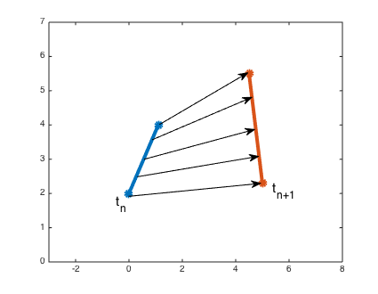

# ALE-DG方法简介

# 简介
ALE-DG（arbitrary Lagrangian-Eulerian discontin-
uous Galerkin）方法是将ALE形式控制方程采用DG方法进行空间离散，而后再进行时间离散方法。其区别于ST-DG（space-time Discontinuous Galerkin）方法，ST-DG是一种时空方法（space-time method），其基函数是定义在 $\mathbb{R}^3 \times [0, T]$ 空间中，离散时是采用时空同时离散方式。ALE-DG与ST-DG相比，更接近传统DG离散形式，不需要对原始格式做太多修改（存在争议）。

# 1.文献综述
近些年来关于ALE-DG格式文献主要有

# 2.理论基础

ALE-DG理论部分与ALE-FEM类似，其都是在动网格上求解微分方程，通过乘以试验函数确定基函数系数。理论介绍参考 Nguyen（2010）[^1] 与 Klingenberg（2015）[^2]，这两篇文献与另外两篇 Persson（2009）[^4] 和 Mavriplis（2011）[^3] 区别主要在于离散空间不同，其本质是一样的，后面会具体介绍其区别。

## 2.1.空间离散

在 Donea（2004）[^5] 的ALE方法中我们介绍过，方程转换成ALE形式主要区别是，多了一个由于网格移动造成的“对流”项。其中，ALE形式控制方程的微分形式与积分形式又有细微区别。

随体导数在Eulerian空间和ALE的参考空间内分别写为

$$\frac{\partial f }{\partial t}\Big|_ X =  \frac{\partial f}{\partial t}\Big|_ {\mathcal{X}} +  \nabla f \cdot \vec{c}$$

$$\frac{\partial f}{\partial t}\Big|_ X = \frac{\partial f}{\partial t} + \nabla f \cdot \vec{v}$$

其中$\vec{c} = \vec{v} - \vec{w}$，$\vec{w}$为该点处参考空间对应节点（网格）运动速度。因此，普通微分方程转换成ALE形式时，需要将时间到处项换为参考空间内时间导数项，即

$$\frac{\partial f}{\partial t} = \frac{\partial f}{\partial t}\Big|\_\mathcal{X} +  \nabla f \cdot \vec{c} -  \nabla f\cdot \vec{v} = \frac{\partial f}{\partial t}\Big|_ \mathcal{X} -  \vec{w} \cdot \nabla f$$

当我们将Eulerian空间内积分方程换成ALE形式时又有所不同。根据Reynolds输运定理，

$$\int_{\Omega(t)} \frac{\partial f}{\partial t} dV = \frac{d}{dt} \int_{\Omega(t)}f dV - \int_{\Omega(t)} \nabla \cdot (\vec{w} f) dV = \frac{d}{dt} \int_{\Omega(t)}f dV - \oint_{\Omega(t)} \vec{n} \cdot \vec{w} f dV$$

根据上面这两个公式，在将方程离散成ALE形式时，应按照以下步骤进行

（注意划线部分，是过去错误的理解）

~~1. 将控制方程时间导数项替换为参考空间内对时间求导形式~~
2. 将~~转换成ALE形式的~~微分方程投影到基函数张成解空间（残差方程和基函数正交）
3. 空间积分时控制单元是移动的，利用Reynolds输运定理将时间导数的积分写成积分对时间求导形式
4. 基函数时间导数积分项转化
5. 时间离散

以 Nguyen（2010）[^1] 为例，普通守恒形式方程为

$$u_t + \nabla \cdot F(u) = 0$$

**残差函数与基函数正交**

$u_h$为近似解，通过使残差函数与基函数正交（垂直于基函数张成的解空间），使近似解$u_h$逼近真实解。

$$\int_k \varphi_i \frac{\partial u_h}{\partial t}dx + \int_k \varphi_i \nabla \cdot F(u_h) dx = 0$$

通过Reynolds输运定理将时间导数的积分写成积分对时间求导形式

**时间导数的积分换成积分对时间求导**

由于单元 $k$ 是移动的，每点处其移动速度为 $w(\vec{x},t)$，利用Reynolds输运定理

$$\frac{d}{dt} \int_{k(t)} \varphi_i u_h dx = \int_{k(t)} \big(\varphi_i \frac{\partial u_h}{\partial t} + \frac{\partial \varphi_i}{\partial t} u_h \big) dx + \oint_{\partial k(t)} \varphi_i u_h w_n ds$$

其中$w_n = \vec{w} \cdot \vec{n}$为网格速度在单元边界外法线上投影。

代入离散方程内，并采用分部积分，得

$$\frac{d}{dt} \int_{k(t)} \varphi_i u_h dx - \int_{k(t)} \frac{\partial \varphi_i}{\partial t} u_h dx - \int_{k(t)} \nabla \varphi_i  \cdot F(u_h) dx + \oint_{\partial k(t)} \varphi_i \big( F(u_h)\cdot \vec{n} - u_h w_n \big) ds = 0$$

这个方程与传统固定网格DG离散格式相比，多了两项

1. 基函数关于时间导数项（Eulerian空间） $\int_{k(t)} \frac{\partial \varphi_i}{\partial t} u_h dx$
2. 网格移动造成通量变换 $\oint_{\partial k(t)} \varphi_i u_h w_n ds$

**基函数时间导数积分项**
利用物质导数关系，我们知道

$$\frac{d \varphi_i}{d t} = \frac{\partial \varphi_i}{\partial t} +  \vec{w} \cdot \nabla \varphi_i$$

其中$\vec{w}$为基函数移动速度，因为基函数与控制体一起移动，因此其速度与控制体运动速度完全相同。

下面利用一个不是很显然的结论，即基函数的物质导数为0

$$\frac{d \varphi_i}{d t} = \frac{\partial \varphi_i}{\partial t} +  \vec{w} \cdot \nabla \varphi_i = 0$$

此时便可将$\int_{k(t)} \frac{\partial \varphi_i}{\partial t} u_h dx = - \int_{k(t)} \nabla \varphi_i \cdot \vec{w} u_h dx$ 代入离散方程，得

$$\begin{aligned}
\frac{d}{dt} \int_{k(t)} \varphi_i u_h dx = \int_{k(t)} \nabla \varphi_i  \cdot \big( F(u_h) - u_h \vec{w} \big) dx - \oint_{\partial k(t)} \varphi_i \big( F(u_h)\cdot \vec{n} - u_h w_n \big) ds = 0
\end{aligned}$$

可是使用新的流量项$\mathcal{F}(u_h) = F(u_h) - u_h \vec{w}$代入，便可得到与固定网格上DG离散方程相同形式

$$\frac{d}{dt} \int_{k(t)} \varphi_i u_h dx = \int_{k(t)} \nabla \varphi_i  \cdot \mathcal{F}(u_h) dx - \oint_{\partial k(t)} \varphi_i \mathcal{F}(u_h) \cdot \vec{n} ds = 0$$

**时间离散**

此离散方程可以写为

$$
(M\bar{U}_h)_ t = L(\bar{U}_h)$$

其中

$$M_{ij}^{k(t)} = \int_{k(t)} \varphi_i \varphi_j dx$$

为质量矩阵，

$$L(\bar{U}\_h) = \int_{k(t)} \nabla \varphi_i  \cdot \mathcal{F}(u_h) dx - \oint_{\partial k(t)} \varphi_i \mathcal{F}(u_h) \cdot \vec{n} ds$$

为离散方程右端项，注意新的流量项$\mathcal{F}(u_h)$与原始流量项$F(u_h)$区别。

## 2.2.基函数映射

上面离散过程中利用了基函数物质导数为0的假定$\frac{d \varphi_i}{dt} = 0$，下面来看单元移动过程中这个条件是否成立。

ALE方法中有两种移动形式，给定网格运动速度或给定网格运动位置。在动边界问题中，常用的方法是令边界处单元坐标固定在运动边界上，然后通过其他方法计算内部计算域内每个单元节点位置。常用方法有利用最小二乘法或求解Laplace方程等方法。在三维海洋模型中，自由表面为动边界，利用 $\sigma$ 网格运动形式便可确定计算域内每个网格节点位置，且一般自由面运动幅度不大，不需要做特殊处理。ST-DG方法则需要给定每个时刻单元运动位置，以此才能够将单元投影至标准单元中，因此所有ST-DG方法都是给定单元坐标形式。

在确定每个时刻单元位置后，剩下的问题就是在两个时间步之间单元是如何运动的？在大部分以给定节点形式令单元运动的方法中（ST-DG方法及 Klingenberg（2015）[^2] 等），皆认为单元是匀速运动。因此，在两个时间步之间速度为常数

$$\vec{w} = \frac{x^{n+1} - x^n}{t_{n+1} - t_{n}}$$

以一维线单元为例，单元 $K_j (t) := [x_{j-\frac{1}{2}}(t) , x_{j+\frac{1}{2}}(t)]$ 长度计算公式为 $\Delta_j(t) = x_{j+\frac{1}{2}}(t) - x_{j-\frac{1}{2}}(t)$，线段端点匀速运动，因此单元长度变化为

$$\Delta_j(t) = (w_{j+\frac{1}{2}} - w_{j-\frac{1}{2}})(t - t_n) + \Delta_j(t_n) = x_{j+\frac{1}{2}}(t) - x_{j-\frac{1}{2}}(t) > 0$$

只知道单元端点运动还不够，还需要知道单元内每个点运动过程，才能够完整描述单元运动。可以通过给定单元每个点在时刻$t_{n+1}$坐标位置来确定网格速度在单元内分布，或者通过给定速度$\vec{w}$分布亦可以得到在下个时刻$t_{n+1}$坐标位置。不管通过哪种方法，只要保证单元端点在$t_{n+1}$时刻运动到给定位置即可。

因此，这里假定网格运动速度在单元内线性分布，即

$$w(x,t) = w_{j+\frac{1}{2}}\frac{ x-x_{j-\frac{1}{2}}(t) }{\Delta_j(t)} + w_{j-\frac{1}{2}} \frac{ x_{j+\frac{1}{2}}(t) - x }{\Delta_j(t)}$$

到这里，ALE动网格运动形式已经完全确定，可以按照过去的DG方法将单元映射到标准单元/参考单元（reference cell）上。在一维情形中，标准线单元定义在[-1, 1]区间上，其映射函数为

$$\mathscr{X}\_j:[-1, 1] \to K_j(t), \quad \mathscr{X}\_j(\xi,t) = \frac{1}{2}\Delta_j(t)(\xi + 1) + x_{j-\frac{1}{2}}(t)$$

可以看出，投影至Eulerian空间内坐标 $\mathscr{X}_j$ 对时间导数恰为该点网格运动速度

$$\partial_t( \mathscr{X}\_j(\xi,t) ) = \frac{1}{2}(\xi + 1)(w_{j+\frac{1}{2}} - w_{j-\frac{1}{2}}) + w_{j-\frac{1}{2}}$$

定义标准单元内基函数空间 $P^k[-1,1]$ 为 $\varphi_0(\xi), ... \varphi_k(\xi)$，那么在Eulerian空间内基函数形式为

$$\hat{\varphi}\_l(x,t) = \varphi_l(\xi) = \varphi_l\Big(\frac{2(x-x_{j-\frac{1}{2}}(t))}{\Delta_j(t)} - 1 \Big)$$

下面来证明Eulerian空间内基函数物质导数为0。

**方法1.直接计算物质导数**

直接计算物质导数要求只将 $t$ 作为唯一变量，空间变量也是随时间变化的 $x(t)$。因此根据链式法则

$$\begin{aligned}
& \frac{d \hat{\varphi}}{dt} = \frac{d \varphi}{dt} = \frac{d \varphi}{d \xi}\frac{d \xi}{dt} \cr
& = 2\varphi'\frac{ (\frac{d x(t)}{dt} - w_{j-\frac{1}{2}})\Delta_j(t) - [x(t) - x_{j-\frac{1}{2}}(t)]\frac{d \Delta_j(t)}{dt} }{\Delta_j^2(t)} \cr
& = 2\varphi'\frac{ \frac{1}{2}(\xi + 1)(w_{j+\frac{1}{2}} - w_{j-\frac{1}{2}})\Delta_j(t) - (x(t) - x_{j-\frac{1}{2}}(t))(w_{j+\frac{1}{2}} - w_{j-\frac{1}{2}}) }{\Delta_j^2(t)} \cr
& = 0
\end{aligned}$$

**方法2.计算偏导**

偏导计算时讲空间变量 $x$ 与时间变量 $t$ 看作两个互相独立的变量，首先时间导数计算为

$$\begin{aligned}
& \frac{\partial \hat{\varphi}(x,t)}{\partial t} = \frac{\partial \varphi(\xi(x,t))}{\partial t} = \varphi'\frac{\partial \xi}{\partial t} \cr
& = 2\varphi'\frac{-w_{j-\frac{1}{2}} \Delta_j - [x(t) - x_{j-\frac{1}{2}}(t)]\frac{\partial \Delta_j(t)}{\partial t} }{\Delta_j^2(t)} \cr
& = 2\varphi'\frac{-w_{j-\frac{1}{2}} [x_{j+\frac{1}{2}}(t) - x_{j-\frac{1}{2}}(t)] - (x(t) - x_{j-\frac{1}{2}}(t))(w_{j+\frac{1}{2}} -w_{j-\frac{1}{2}}) }{\Delta_j^2(t)} \cr
& = -\frac{2}{\Delta_j(t)} w(x,t) \varphi'
\end{aligned}$$

空间导数计算较为简单

$$\begin{aligned}
& \frac{\partial \hat{\varphi}(x,t)}{\partial x} = \frac{\partial \varphi(\xi(x,t))}{\partial x} = \varphi'\frac{\partial \xi}{\partial x} \cr
& = \varphi'\frac{2}{\Delta_j(t)}
\end{aligned}$$

由上述两个表达式，就可以看出

$$\frac{\partial \hat{\varphi}(x,t)}{\partial t} + w(x,t)\frac{\partial \hat{\varphi}(x,t)}{\partial x} = 0$$

即，基函数的物质导数 $\frac{d \varphi}{dt} = 0$

## 2.3.其他空间离散方式

Persson（2009）[^4] ， Mavriplis（2011）[^3] 和 Wang（2015）[^6] 计算离散形式时，其利用动网格所在的Eulerian空间投影至参考空间内，这个投影在积分中产生一个Jacobian系数 $J_k(t)$，虽然最终结果形式一致，这三篇文章思路又稍有不同。

Mavriplis（2011）[^3] 首先利用上面ALE-DG方法得到Eulerian空间内离散方程，然后将计算域投影到参考空间内。因为在Eulerian空间内，运动的控制体内坐标 $\mathscr{X}_i(t)$ 对应的参考坐标 $\mathcal{X}_i$ 在参考空间中 不随时间变化，因此就将一个运动的体积分转化成了固定控制体上积分，运动体现在Jacobian系数 $J_k(t)$ 的变化上。

Persson（2009）[^4] 与 Wang（2015）[^6] 则是采用完全不同思路。他们首先将控制方程转换到参考空间（ALE形式），由于Eulerian空间中运动的控制体在参考空间中固定，因此可以在参考空间内按照普通DG方法进行空间离散。

最终形式一般为

$$\frac{d}{dt} \int_{K} J_k\varphi_i U_h dV = \int_{K} \nabla \varphi_i  \cdot \mathcal{F}(u_h) J_k^{-1}|J_k| dV - \oint_{\partial K} \varphi_i \mathcal{F}(u_h) \cdot \vec{n} |J_k|d(\partial V)$$

其中Jacobian系数 $J_k(t)$ 是随时间变化的。

# 3.GCL（geometric conservation law）是否满足？

* Nguyen（2010）[^1] 根据雷诺输运定理及基函数随网格运动条件，因此$\int_{K(t)}(\frac{\partial \varphi}{\partial t} + \nabla \varphi \cdot \vec{w}) dx = 0 $，说明ALE-DG格式是始终是满足GCL的。
* Ren（2015）[^7] 则采用数值验证的方法来证明GCL误差影响不大。
* Klingenberg（2015）[^2] 指出虽然ALE-DG隐含GCL条件，但是使用时间离散格式后不一定满足DGCL（discrete GCL）条件，但是采用显式Euler时间递进方法的格式是满足DGCL的。
* Lomtev（1999）[^8] 网格速度散度为0，因此DGCL始终满足。
* 在Mavriplis（2011）[^3] 文章中，由于网格速度不确定（同Klingenberg及），因此其不认为GCL条件是始终满足的。
* Persson（2009）[^4]， Wang & Persson（2015）[^6] 认为由于Jacobian系数J计算不准确，GCL误差存在的，但是其在高阶离散格式中影响不大。

#4.算例验证

[^1]: Nguyen, V.-T., 2010. An arbitrary Lagrangian–Eulerian discontinuous Galerkin method for simulations of flows over variable geometries. Journal of Fluids and Structures 26, 312–329. doi:10.1016/j.jfluidstructs.2009.11.002

[^2]: Klingenberg, C., Schnücke, G., Xia, Y., 2015. Arbitrary Lagrangian-Eulerian discontinuous Galerkin method for conservation laws: analysis and application in one dimension. submitted to Mathematics of Computations.

[^3]: Mavriplis, D.J., Nastase, C.R., 2011. On the geometric conservation law for high-order discontinuous Galerkin discretizations on dynamically deforming meshes. Journal of Computational Physics 230, 4285–4300. doi:10.1016/j.jcp.2011.01.022

[^4]: Persson, P.-O., Bonet, J., Peraire, J., 2009. Discontinuous Galerkin solution of the Navier–Stokes equations on deformable domains. Computer Methods in Applied Mechanics and Engineering 198, 1585–1595. doi:10.1016/j.cma.2009.01.012

[^5]: Donea, J., Huerta, A., Ponthot, J.-P., Rodríguez-Ferran, A., 2004. Arbitrary Lagrangian–Eulerian Methods, in: Encyclopedia of Computational Mechanics. John Wiley & Sons, Ltd.

[^6]: Wang, L., Persson, P.-O., 2015. High-order discontinuous Galerkin simulations on moving domains using an ALE formulation and local remeshing with projections. Presented at the AIAA SciTech, 53rd AIAA Aerospace Sciences Meeting, pp. 2015–0820.

[^7]: Ren, X., Xu, K., Shyy, W., 2015. A multi-dimensional high-order DG-ALE method based on gas-kinetic theory with application to oscillating airfoils. J. Comput. Phys 292, 176–193.

[^8]: Lomtev, I., Kirby, R.M., Karniadakis, G.E., 1999. A discontinuous Galerkin ALE method for compressible viscous flows in moving domains. Journal of Computational Physics 155, 128–159.
