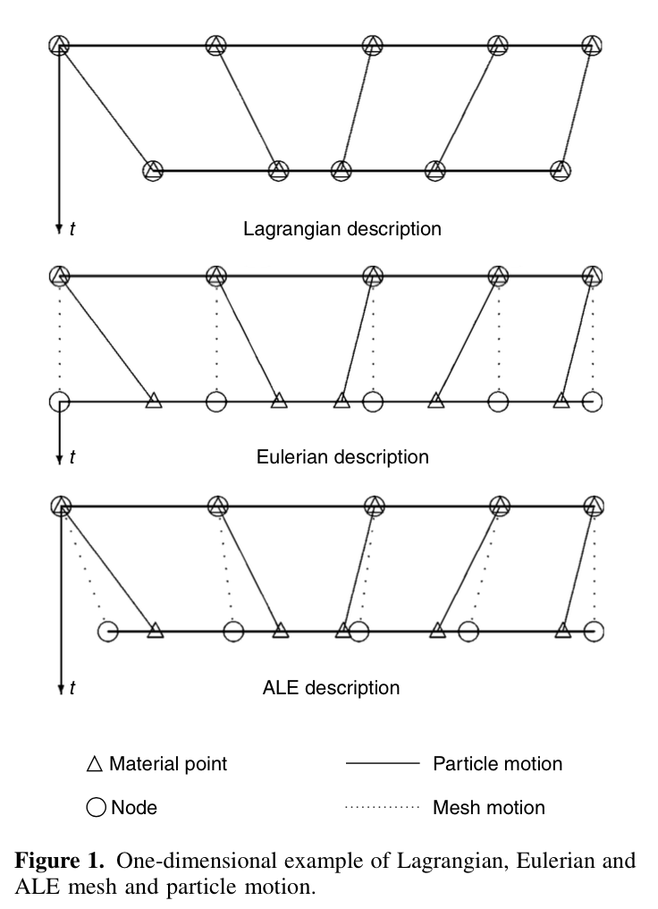
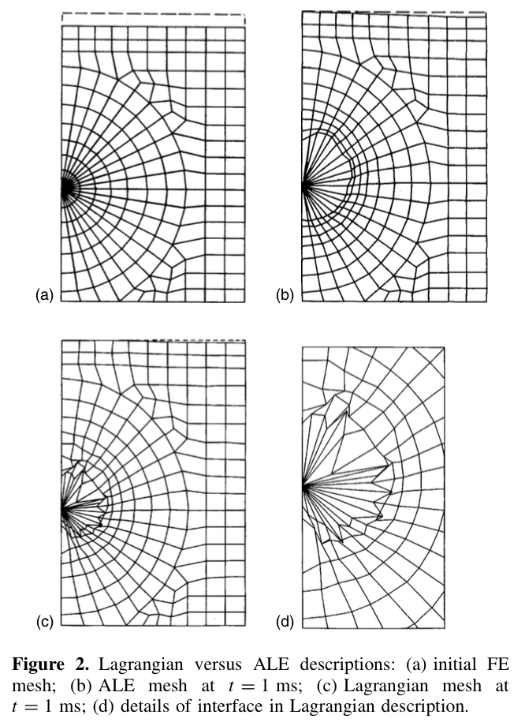
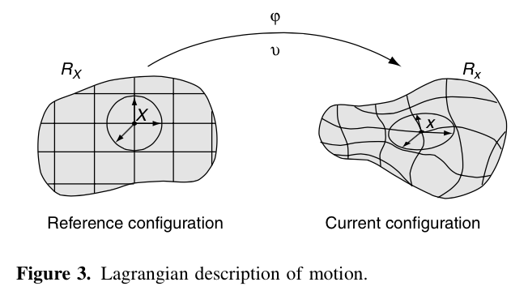
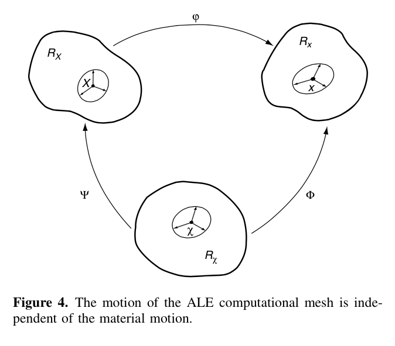

# Arbitrary Lagrangian Eulerian Methods $^1$

<!-- TOC -->

- [Arbitrary Lagrangian Eulerian Methods $^1$](#arbitrary-lagrangian-eulerian-methods-^1)
    - [1.1. ALE方法简介](#11-ale方法简介)
    - [1.2. ALE 方法与 Lagrangian 及 Eulerian 方法关系](#12-ale-方法与-lagrangian-及-eulerian-方法关系)
        - [1.2.1. Lagrangian 方法与 Eulerian 方法描述物体运动](#121-lagrangian-方法与-eulerian-方法描述物体运动)
        - [1.2.2. ALE 方法描述物质运动](#122-ale-方法描述物质运动)
    - [1.3. ALE 方程基础](#13-ale-方程基础)
    - [1.4. ALE 方法中积分形式方程](#14-ale-方法中积分形式方程)
    - [1.5. 几何守恒律[^4]](#15-几何守恒律^4)
    - [1.6. 文献综述](#16-文献综述)
    - [1.7. Reference](#17-reference)

<!-- /TOC -->

---
## 1.1. ALE方法简介

在高维流体动力学和非线性固体力学数值模拟中，经常需要考虑如何处理连续体剧烈扭曲问题，同时允许自由表面和流体-流体，固体-固体或流体-固体边界等交界面精确描述。用于此类模拟问题的程序最根本问题是选择适当的坐标系来描述连续体的运动。事实上，坐标系的选择决定了描述变形连续体或计算区域的网格，并且因此数值方法在处理连续体大变形和物体边界描述精度都有所提高。

常用来描述物体运动的方法有两种，Lagrangian 方法与 Eulerian 方法。

Lagrangian 方法中每个网格节点都随相应地连续体物质运动，主要用在固体动力学模拟中。Lagrangian 描述方法很容易捕捉自由面及不同流体边界面运动过程，同时处理物体随时间变化问题也很方便。其缺点是计算域内不能出现较大变形，否则需要频繁地对网格进行重新划分，耗费大量计算资源。

Eulerian 方法广泛应用于计算流体动力学问题，如图1中所示计算网格是固定的，连续体（流体）相对网格进行运动。在 Eulerian 方法中，连续体大变形可以很好描述出来，但是清晰的定义流体边界就需要高精度流体运动信息。

因为 Lagrangian 和 Eulerian 各自存在的缺点，一种新的混合方法 ALE(Arbitrary Lagrangian Eulerian) 越来越得到重视。ALE 方法中，网格单元节点可以任意运动，包括对流体运动（Lagrangian 方法），或者静止（Eulerian 方法）。由于 ALE 方法网格可以任意运动，因此其能够比 Lagrangian 更灵活地处理连续体大变形问题，并且保证物质界面仍然可以像 Lagrangian 方法中一样清晰定义，如图2所示。

本文主要对 ALE 方法进行简单介绍，第2节介绍 ALE 框架下物体运动偏微分方程（PDE），第3节介绍积分形式 ALE 方程，及其在 FVM 方法中应用，有关几何守恒律（Geometric Conservation Laws）介绍放在第4节，第5阶对最近一些文献做简要介绍。对于 ALE-DG 方法，将放在下一篇介绍中。

---
## 1.2. ALE 方法与 Lagrangian 及 Eulerian 方法关系

### 1.2.1. Lagrangian 方法与 Eulerian 方法描述物体运动

首先介绍两个空间，Lagrangian 空间 $R_X \subset \mathbb{R}^n$ 与 Eulerian 空间 $R_x$。Lagrangian 空间 $R_X$ 由物质坐标 $X$ 构成，网格点固定在物质坐标上，随流体一起运动；Eulerian 空间 $R_x$ 由空间坐标 $x$ 构成，网格点固定在空间节点上。物体运动时，由物质坐标投影到空间坐标时，可以使用映射

$$
\begin{aligned}
& \mathbf{\varphi}: R_X \times [t_0, t_1] \to R_x \times [t_0, t_1] \cr
& (\vec{X},t) \to \varphi(\vec{X},t) = (\vec{x},t) \cr
\end{aligned}
$$

这时描述物体运动位置的方程也可以表示为

$$\begin{equation}
\vec{x} = \vec{x}(\vec{X},t)
\end{equation}$$

有关$\varphi$的方程有两点需要注意

1. 空间坐标依赖于物质坐标和时间
2. Eulerian 空间和 Lagrangian 空间中时间都是相同的物理时间

假如我们计算映射 $\varphi$ 的梯度

$$\begin{equation}
\frac{\partial \varphi}{\partial (\vec{X},t)} =
\begin{pmatrix}
\frac{\partial \vec{x}}{\partial \vec{X}} & \vec{v} \cr
0^T & 1
\end{pmatrix}
\end{equation}$$

其中 $\vec{v}$ 为物质颗粒的运动速度

$$\begin{equation}
\vec{v}(\vec{X},t) = \frac{\partial \vec{x}}{\partial t} \Big|_X
\end{equation}$$

其中下标 $|_X$ 的含义是“保持物质坐标 X 不变”。

### 1.2.2. ALE 方法描述物质运动

上一节重新介绍了熟悉的 Lagrangian 空间和 Eulerian 空间及其相互转换，上面可以看出可以有一种更一般的描述方法融合两种空间，其结合两种传统坐标的优点并且尽量减少其缺点。这种方法就是ALE方法。

ALE方法描述物质运动，既非物质坐标空间 $R_X$ 也不是空间坐标空间 $R_x$。因此，需要提出一个新的坐标空间 $R_\mathcal{X}$，其由参考坐标 $\mathcal{X}$ 组成。图4介绍了三种空间相互转换关系

可以看出，三个坐标映射函数并非相互独立的，由参考空间 $R_\mathcal{X}$ 到 Eulerian 坐标空间 $R_x$ 映射 $\mathbf{\Phi}$ 为

$$\begin{eqnarray}
\begin{aligned}
& \mathbf{\Phi}: R_\mathcal{X} \times [t_0, t_1] \to R_x \times [t_0, t_1] \cr
& (\vec{\mathcal{X}},t) \to \Phi(\vec{\mathcal{X}},t) = (\vec{x},t) \cr
\end{aligned}
\end{eqnarray}$$

其梯度为

$$\begin{equation}
\frac{\partial \Phi}{\partial (\vec{\mathcal{X}},t)} =
\begin{pmatrix}
\frac{\partial \vec{x}}{\partial \vec{\mathcal{X}}} & \vec{v}_\mathcal{X} \cr
0^T & 1
\end{pmatrix}
\end{equation}$$

其网格运动速度为

$$\begin{equation}
\vec{v}\_\mathcal{X}(\mathcal{X}, t) = \frac{\partial x}{\partial t} \Big|\_\mathcal{X}
\end{equation}$$

映射 $\mathbf{\Psi^{-1}}$ 表示 Lagrangian 空间 $R_X$ 到参考空间 $R_\mathcal{X}$ 的映射

$$\begin{eqnarray}
\begin{aligned}
& \mathbf{\Psi}^{-1}: R_X \times [t_0, t_1] \to R_\mathcal{X} \times [t_0, t_1] \cr
& (\vec{X},t) \to \Psi^{-1}(\vec{\mathcal{X}},t) = (\vec{\mathcal{X}},t) \cr
\end{aligned}
\end{eqnarray}$$

其梯度

$$\begin{equation}
\frac{\partial \Psi^{-1}}{\partial (\vec{X},t)} =
\begin{pmatrix}
\frac{\partial \vec{\mathcal{X}}}{\partial \vec{X}} & \vec{w} \cr
0^T & 1
\end{pmatrix}
\end{equation}$$

速度 $\vec{w}$ 为

$$\begin{equation}
\vec{w} = \frac{\partial \vec{\mathcal{X}}}{\partial t} \Big|_X
\end{equation}$$

表示在参考空间 $R_\mathcal{X}$ 中物质运动速度。

根据三个映射的关系 $\varphi = \Phi \circ \Psi^{-1}$ 可得

$$\begin{equation}
\frac{\partial \varphi}{\partial (X, t)}(X, t) = \frac{\partial \Phi}{\partial (\mathcal{X},t)}(\Psi^{-1}(X, t)) \frac{\partial \Psi^{-1}}{\partial (X,t)}(X,t) = \frac{\partial \Phi}{\partial (\mathcal{X},t)}(\mathcal{X},t) \frac{\partial \Psi^{-1}}{\partial (X,t)}(X,t)
\end{equation}$$

根据其梯度矩阵

$$\begin{equation}
\begin{pmatrix}
\frac{\partial \vec{x}}{\partial \vec{X}} & \vec{v} \cr
0^T & 1
\end{pmatrix} =
\begin{pmatrix}
\frac{\partial \vec{x}}{\partial \vec{\mathcal{X}}} & \vec{v}_\mathcal{X} \cr
0^T & 1
\end{pmatrix}
\begin{pmatrix}
\frac{\partial \vec{\mathcal{X}}}{\partial \vec{X}} & \vec{w} \cr
0^T & 1
\end{pmatrix}
\end{equation}$$

由此可得

$$\begin{equation}
\vec{v} = \vec{v}_\mathcal{X} + \frac{\partial \vec{x}}{\partial \vec{\mathcal{X}}} \cdot \vec{w}
\end{equation}$$

定义 $\vec{c}$ 为在 Eulerian 空间中物质坐标 $X$ 与参考坐标 $\mathcal{X}$ 速度之差，上式可改写为

$$\begin{equation}
\vec{c} = \vec{v} - \vec{v}_\mathcal{X} = \frac{\partial \vec{x}}{\partial \vec{\mathcal{X}}} \cdot \vec{w}
\end{equation}$$

这个公式的含义是表示物质颗粒与参考坐标网格的速度之间差值在两个坐标系内关系，其中 $\vec{c}$ 为二者在 Eulerian 空间内速度之差，$\vec{w}$ 为二者在参考空间 $R_\mathcal{X}$ 内速度之差。

---

## 1.3. ALE 方程基础

假设有一标量场，在三个空间内函数形式分别为$f(x,t)$，$f^\*(\mathcal{X},t)$，$f^\**(X,t)$，上端星号用来强调方程形式不同。

由于三个空间具有映射关系，因此也可用复合函数形式表示方程不同形式

$$\begin{equation}
f^{\*\*} (X,t) = f(\varphi(X,t),t) \quad \text{or} \quad f^{\*\*} = f\circ\varphi
\end{equation}$$

因此标量方程导数之间具有关系

$$\begin{equation}
\frac{\partial f^{\*\*} }{\partial (X,t)} = \frac{\partial f}{\partial (x,t)} \frac{\partial \varphi}{\partial (X,t)}(X,t)
\end{equation}$$

其向量形式为

$$\begin{equation}
\begin{pmatrix}
\frac{\partial f^{\*\*} }{\partial X} & \frac{\partial f^{\*\*} }{\partial t}
\end{pmatrix}=
\begin{pmatrix}
\frac{\partial f}{\partial x} & \frac{\partial f}{\partial t}
\end{pmatrix}
\begin{pmatrix}
\frac{\partial x}{\partial X} & \vec{v} \cr
0^T & 1
\end{pmatrix}
\end{equation}$$

由此有

$$\begin{equation}
\frac{\partial f^{\*\*} }{\partial t} = \frac{\partial f}{\partial t} + \frac{\partial f}{\partial x}\cdot \vec{v}
\end{equation}$$

这就是我们熟悉的随体导数表达式。将星号略去

$$\begin{equation}
\frac{\partial f}{\partial t}\Big|_X = \frac{\partial f}{\partial t}\Big|_x + \nabla f\cdot \vec{v}
\end{equation}$$

同样的，根据 Lagrangian 空间与参考空间映射关系，有

$$\begin{equation}
f^{\*\*} = f^\* \circ \Psi^{-1}
\end{equation}$$

其导数向量之间关系为

$$\begin{equation}
\frac{\partial f^{\*\*}}{\partial (X,t)} = \frac{\partial f^\*}{\partial (\mathcal{X},t)} \frac{\partial \Psi^{-1}}{\partial (X,t)}(X,t)
\end{equation}$$

其向量形式为

$$\begin{equation}
\begin{pmatrix}
\frac{\partial f^{\*\*} }{\partial X} & \frac{\partial f^{\*\*} }{\partial t}
\end{pmatrix} =
\begin{pmatrix}
\frac{\partial f^\*}{\partial \mathcal{X}} & \frac{\partial f^\*}{\partial t}
\end{pmatrix}
\begin{pmatrix}
\frac{\partial \mathcal{X} }{\partial X } & \vec{w} \cr
0^T & 1
\end{pmatrix}
\end{equation}$$

其中时间导数关系为

$$\begin{equation}
\frac{\partial f^{\*\*} }{\partial t} = \frac{\partial f^\*}{\partial t} + \frac{\partial f^\*}{\partial \mathcal{X}}\cdot \vec{w}
\end{equation}$$

根据参考空间与 Eulerian 空间映射关系

$$\begin{equation}
f^\*(\mathcal{X},t) = f(\Phi(\mathcal{X},t), t) \quad \text{or} \quad f^\* = f \circ \Phi
\end{equation}$$

导数之间关系

$$\begin{equation}
\frac{\partial f^\*}{\partial (\mathcal{X},t)} = \frac{\partial f}{\partial (x,t)} \frac{\partial \Phi}{\partial (\mathcal{X},t)}(\mathcal{X},t)
\end{equation}$$

其向量形式为

$$\begin{equation}
\begin{pmatrix}
\frac{\partial f^{\*} }{\partial \mathcal{X}} & \frac{\partial f^{\*} }{\partial t}
\end{pmatrix} =
\begin{pmatrix}
\frac{\partial f}{\partial x} & \frac{\partial f}{\partial t}
\end{pmatrix}
\begin{pmatrix}
\frac{\partial x}{\partial \mathcal{X}} & \vec{v}_\mathcal{X} \cr
0^T & 1
\end{pmatrix}
\end{equation}$$

这次我们取其空间导数之间关系

$$\begin{equation}
\frac{\partial f^{\*} }{\partial \mathcal{X}} = \frac{\partial f}{\partial x}\frac{\partial x}{\partial \mathcal{X}}
\end{equation}$$

将方程(27)代入(23)，并利用(14)可得

$$\begin{equation}
\frac{\partial f^{\*\*} }{\partial t} = \frac{\partial f^\*}{\partial t} + \frac{\partial f}{\partial x} \cdot \vec{c}
\end{equation}$$

去掉星号，用下标表示为

$$\begin{equation}
\frac{\partial f }{\partial t}\Big|\_X = \frac{\partial f}{\partial t}\Big|\_\mathcal{X} + \frac{\partial f}{\partial x} \cdot \vec{c} = \frac{\partial f}{\partial t}\Big|\_\mathcal{X} + \vec{c} \cdot \nabla f
\end{equation}$$

这个公式展示了使用ALE方法时物质导数产生的变化，$\frac{\partial f}{\partial t}\Big|\_\mathcal{X}$ 固定在参考坐标节点上的标量方程随时间变化，而 $\vec{c} \cdot \nabla f$ 为普通的对流项，但是这时对流速度已经发生变化，不再是物质颗粒的运动速度 $\vec{c}$，而是物质颗粒与网格在 Eulerian 坐标内速度差值 $\vec{c} = \vec{v} - \vec{v}_\mathcal{X}$

---

## 1.4. ALE 方法中积分形式方程

雷诺输运定理表述了控制体运动时，其体积内标量积分随时间变化关系

$$\begin{equation}
\frac{d}{dt} \int_{\Omega(t)}f dV = \int_{\Omega(t)} \frac{\partial f}{\partial t} dV + \int_{\partial \Omega(t)}(\vec{v}^b \cdot n)f dA
\end{equation}$$

此时控制体边界运动速度为$\vec{v}^b$

在参考空间内使用FVM方法时首先将方程在控制单元内积分，如对流方程

$$\begin{equation}
\frac{\partial f}{\partial t}\Big|_x + \nabla \cdot (\vec{v} f) = 0
\end{equation}$$

积分后得

$$\begin{equation}
\int_{\Omega(t)} \Big( \frac{\partial f}{\partial t}\Big|_x + \nabla \cdot (\vec{v} f) \Big)dV = 0
\end{equation}$$

根据雷诺输运定理，控制体运动速度为 $\vec{v}_\mathcal{X}$ 时

$$\begin{equation}
\int_{\Omega(t)} \frac{\partial f}{\partial t} dV = \frac{d}{dt} \int_{\Omega(t)}f dV - \int_{\Omega(t)} \nabla(\vec{v}_\mathcal{X} f) dV
\end{equation}$$

代入积分方程中，得

$$\begin{equation}
\frac{d}{dt} \int_{\Omega(t)}f dV + \int_{\Omega(t)} \nabla \cdot [(\vec{v} - \vec{v}_\mathcal{X}) f] dV = 0
\end{equation}$$

即

$$\begin{equation}
\frac{d}{dt} (V \cdot \bar{f}) = L(f,t)
\end{equation}$$

其中 $\bar{f}$ 代表单元积分均值

$$\bar{f} = \frac{1}{V(t)} \int_{\Omega(t)}f dV $$

与 Eulerian 网格上FVM方程离散形式不同的是

1. 单元体积$V$及外法向量$\vec{n}$随时间变化
2. 对流速度为流场速度与网格速度差值$\vec{v} - \vec{v}_\mathcal{X}$

---
## 1.5. 几何守恒律[^4]

方程(34)中，当流场内标量场为恒常数 $f=const$ ，并且流速为0时，方程化为

$$\begin{equation}
\frac{d}{dt} \int_{\Omega(t)} dV - \int_{\Omega(t)} \nabla \cdot \vec{v}_\mathcal{X} dV = 0
\end{equation}$$

若采用的数值格式能够精确计算上述方程，则称数值格式满足 GCL（） 准则。

将方程在时间上进行积分，可得

$$\begin{eqnarray}
\begin{aligned}
\big| \Omega_i^{n+1} \big| - \big| \Omega_i^{n} \big|  = \int^{t^{n+1}}\_{t^n} \int_{\Omega(t)} \nabla \cdot \vec{v}\_\mathcal{X} dV = \int^{t^{n+1}}\_{t^n} \big(\int_{ \partial \Omega_i(t) } \vec{v}\_\mathcal{X} \cdot \vec{n} ds \big) dt \cr
= \sum\_{j\in V(i)} \int^{t^{n+1}}\_{t^n} \big| \partial \Omega_{ij}(t) \big| k_{ij}(t) dt
\end{aligned}
\end{eqnarray}$$

其中 $k_{ij}(t)$ 为单元i中边界j在外法线方向运动速度分量 $\vec{v}\_\mathcal{X} \cdot \vec{n}$，上述方程为离散几何守恒律。如何正确选取 $\big| \partial \Omega_{ij}(t) \big|$ 及 $k_{ij}(t)$ 称为 FVM 格式满足 DGCL 的关键。

目前认为GCL有两个作用

1. 提高数值格式在时间离散精度[^2] [^3]
2. 提高时间积分格式稳定性[^8] [^9] [^10]

也有学者提出，GCL对保证格式时间精度不是必要的，如 Mavriplis(2006[^8], 2008[^9], 2011[^10])

[^2]: B. NKonga and H. Guillard, Goudunov type method on non-structured meshes for three-dimensional moving boundary problems, Comp. Meth. Appl. Mech. Eng. 113. 183(1994)

[^3]: B. Koobus and C. Farhat, Second-order time-accurate and geometrically conservative implicit schemes for flow computations on unstructrued dynamic meshes, Comput. Meth. Appl. Mech. Eng. 170, 103(1999)

[^9]: Mavriplis D J, Nastase C R. On the Geometric Conservation Law for High-order Discontinuous Galerkin Discretizations on Dynamically Deforming Meshes[J]. 2008.

[^10]: Mavriplis, D.J., Nastase, C.R., 2011. On the geometric conservation law for high-order discontinuous Galerkin discretizations on dynamically deforming meshes. Journal of Computational Physics 230, 4285–4300. doi:10.1016/j.jcp.2011.01.022

---
## 1.6. 文献综述

ALE首先在FDM与FVM方法中提出，Noh(1964)，Franck & Lazarus(1964)，Trulio(1966)，Hirt(1974)等人最早研究ALE方法在两种数值方法中应用。随后这种方法被应用到FEM中，相关文献可参考 Donea(1977)，Belytschko(1978)，Belytschko & Kennedy (1978)，Hughes(1981)等。

1. Zhou(1999)[^5] 认为sigma坐标转换中没有考虑网格移动造成的影响，因此将ALE方程进行sigma变换，以此用带有网格运动速度的sigma坐标非静压浅水方程进行离散求解。（画蛇添足）
2. Decoene(2009)[^6] 指出sigma变换是ALE方法的一种特例（方程所有项都转换到参考空间），并且详细介绍了sigma坐标中压力梯度误差产生原因，给出一种不等分sigma变换形式以减小误差产生。
>静压不连续现象（*hydrostatically inconsistent*），水平压力梯度误差不会随着网格加密而减小。这个产生于静压连续（*hydrostatically consistent*）条件不满足情况[^7]
3. Donea(2004)[^1] ALE方法详细介绍，本文内容主要参考自这篇文献
4. Farhat(2001)[^2] GCL条件介绍；FVM 离散格式计算时单元外法线 $k_{ij}(t)$ 与边界 $| \partial \Omega_{ij}(t)|$ 选取方法
5. Mavripils(2006)[^8] 将高阶时间精度格式用于动网格问题；满足GCL条件并不是保证格式时间精度的必要条件；GCL可以保证非线性稳定性

[^5]: Zhou, J.G., Stansby, P.K., 1999. An arbitrary Lagrangian-Eulerian sigma (ALES) model with nonhydrostatic pressure for shallow water flows. Comput. Meth. Appl. Mech. Eng. 178, 199–214.

[^6]: Decoene, A., Gerbeau, J.F., 2009. Sigma transformation and ALE formulation for three-dimensional free surface flows. International Journal for Numerical Methods in Fluids 59, 357–386. doi:10.1002/fld.1816

[^7]: Mellor, G.L., Ezer, T., Oey, L.-Y., 1994. The Pressure Gradient Conundrum of Sigma Coordinate Ocean Models. J. Atmos. Oceanic Technol. 11, 1126–1134. doi:10.1175/1520-0426(1994)011<1126:TPGCOS>2.0.CO;2

[^8]: Mavripils, D.J., Yang, Z., 2006. Construction of the discrete geometric conservation law for high-order time-accurate simulations on dynamic meshes. Journal of Computational Physics 213, 557–573. doi:10.1016/j.jcp.2005.08.018

---

## 1.7. Reference

[^1]: Donea, J., Huerta, A., Ponthot, J.-P., Rodríguez-Ferran, A., 2004. Arbitrary Lagrangian–Eulerian Methods, in: Encyclopedia of Computational Mechanics. John Wiley & Sons, Ltd.

[^4]: Farhat, C., Geuzaine, P., Grandmont, C., 2001. The Discrete Geometric Conservation Law and the Nonlinear Stability of ALE Schemes for the Solution of Flow Problems on Moving Grids. Journal of Computational Physics 174, 669–694. doi:10.1006/jcph.2001.6932
