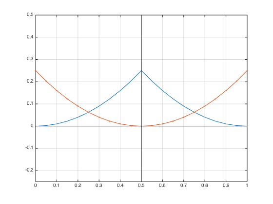

# 1.Introduction of Nodal Discontinuous Galerkin Finite Element Methods

### 1.1.间断有限元与有限元主要区别

**Broken Sobolev spaces**

普通有限元方法，其全局基函数是由各个单元中相同节点的基函数组成。例如下图中，节点$x_j$对应的基函数$l_j(x)$，由相邻单元局部基函数$l_j(x) = l^k_j(x) + l^{k+1}_j(x)$组合而成

因此在计算全局刚度矩阵时，需将单元刚度矩阵进行组合

$$\int_{\Omega}l_j(x)l_j(x)dA = \int_{\Omega^k}l_j(x)l_j(x)dA + \int_{\Omega^{k+1}}l_j(x)l_j(x)dA$$

但是间断有限元不同，其基函数空间为间断Sobolev空间，也就是不存在跨单元的全局基函数概念。其结果是增加了全局基函数的个数，也就增加了基函数系数(未知数)个数。
但是由于两个单元之间没有公用的基函数，因此全局刚度矩阵组合更为简单，不需要合成全局刚度矩阵。

---
###1.2.基函数分类：Model & Nodal

多项式展开式主要由两种类型：Modal 类型与 Nodal 类型[^1]。例如常见三种多项式:

1. moment expansion
$$\Phi_p^A = x^p, p=0, \cdots, P,$$
2. 拉格朗日基函数
$$\Phi_p^B = \frac{\prod^P_{q=0,q\neq p}(x-x_q)}{\prod^P_{q=0,q\neq p}(x_p-x_q)}, p=0, \cdots,P,$$
3. 勒让德基函数
$$\Phi_p^C = L_p(x), p=0,\cdots,P,$$

三种多项式函数图像如下图所示

第一类多项式称之为 moment expansion，其阶数逐渐增大。这类多项式称为 modal expansion 或 hierarchical expansion，因为其P-1阶基组成集合完全包含在P阶基集合内。所以高阶基可以由低阶基生成

$$\chi_2^{\delta} = (1,x,x^2)$$
$$\chi_3^{\delta} = (1,x,x^2, x^3) = \chi_2^{\delta}\cap(x^3)$$

第二类多项式为Lagrange多项式，其基函数集合不具有层次性（$\chi^{\delta}\_P \nsubseteq \chi^{\delta}\_{P+1}$）。
Lagrange基函数值得注意的特点是$\Phi_p^B(x_q) = \delta_{pq}$，由此函数在基函数上投影系数具有特殊的意义

$$u^{\delta}(x_q) = \sum_{p=0}^P u_p\Phi_p^B(x_q) = \sum_{p=0}^P u_p\delta_{pq} = u_q$$

即多项式展开式系数定义为原函数在节点$x_q$处函数值。

第三类多项式勒让德多项式也是modal 类型，且$L_p(x)$在Legendre内积空间内正交

$$(L_p(x),L_q(x)) = \int_{-1}^1 L_p(x)L_q(x)dx=\frac{2}{2p+1}\delta_{pq}$$

因此其质量矩阵

$$M_{p,q} = \int L_p L_q dx = \delta_{pq}$$

可成为简单的单位矩阵。

尽管Legendre正交多项式在计算质量矩阵有很大优势，但是其在计算单元连续性时特别复杂，需要单元内所有基函数共同参与计算。因此普通有限元方法中最常用的仍是Lagrange多项式，或者经修正后的model expansion，单独使用Legendre多项式并不方便。

[^1]: Spectral/hp Element Methods for CFD

---

###1.3.积分点选择：Gauss Lobatto quadrature

**Gauss–Lobatto rules**

Also known as 'Lobatto quadrature', named after Dutch mathematician (Rehuel Lobatto). It is similar to Gaussian quadrature with the following differences:

* The integration points include the end points of the integration interval.
* It is accurate for polynomials up to degree 2n–3, where n is the number of integration points.

Lobatto quadrature of function $f(x)$ on interval [-1, 1]:

$$\int_{-1}^1 {f(x) \, dx} = \frac {2} {n(n-1)}[f(1) + f(-1)] + \sum_{i = 2} ^{n-1} {w_i f(x_i)} + R_n.$$

Abscissas: $x_i$ is the $(i-1)$st zero of $P'_{n-1}(x)$.

Weights:

$$w_i = \frac{2}{n(n-1)[P_{n-1}(x_i)]^2}, \qquad x_i \ne \pm 1.$$

Remainder:

$$R_n = \frac{- n (n-1)^3 2^{2n-1} [(n-2)!]^4}{(2n-1) [(2n-2)!]^3} f^{(2n-2)}(\xi), \qquad -1 < \xi < 1.$$
