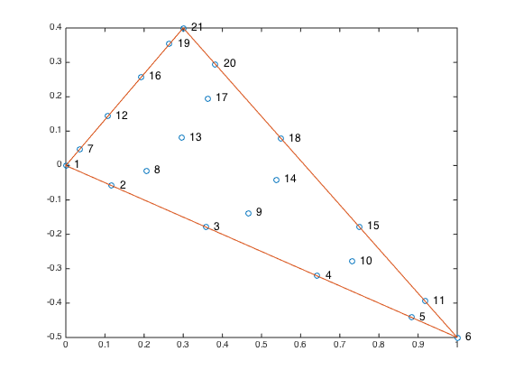
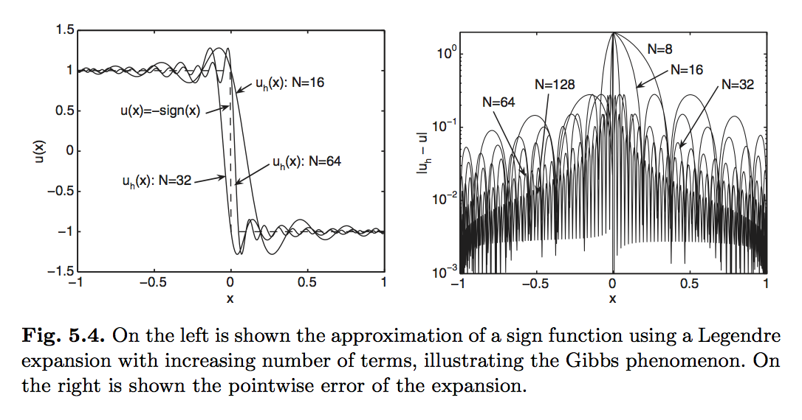
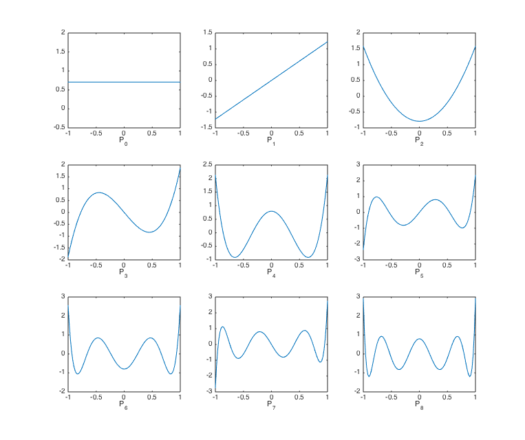
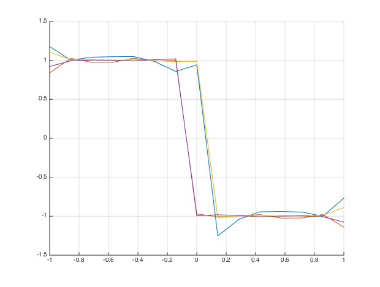

#2.Details about NDG-FEM

[TOC]

##2.1.各类基函数优缺点

前面简介中介绍了 Modal 与 Nodal 两种类型多项式基函数，本节主要介绍两类基函数中最常用的Lagrange多项式与Legrend多项式，讨论它们在DG-FEM计算框架内各自的优缺点。

###2.1.1.Lagrange基函数

Lagrange基函数$l_j(x)$系数$u_j$具有明确的物理意义，除此之外，使用$l_j(x)$还可以简化边界面积分计算。

以二维6阶精度三角形单元为例，21个节点在单元内分布如图

由于基函数为6阶精度，每个$l_i(x,y)$在单元内都是$x,y$的5次幂函数形式，而任意一个节点的基函数在其他节点处都为0。所以，可以看出除了那些节点在外边界上的基函数之外，其余节点在此边界上始终为0，即$l_i(\vec{x}) = 0$。以此，使用Lagrange基函数能够使面积分大为简化。

例如，对节点1-6所在的边界上进行线积分

$$EdgeMass = \oint_{\partial \Omega}
\begin{bmatrix}
l_0 l_0 & l_0 l_1 & \dots & l_0l_P \cr
l_1l_0 & l_1l_1 & \dots & l_1l_P \cr
\dots \cr
l_P l_0 & l_Pl_1 & \dots & l_P l_P \cr
\end{bmatrix} ds = \oint_{\partial \Omega}
\begin{bmatrix}
\bf{M^1} & 0 & \dots & 0 \cr
0 & 0 & \dots & 0 \cr
\dots
\end{bmatrix} ds$$

其中$\bf{M^1}$与一维5阶精度线单元质量矩阵完全相同（同为Gauss Lobatto节点）。

Lagrange展开式的缺点在于，若单元内有间断情况出现，会出现Gibbs振荡产生。例如，用展开式逼近函数

$$u(s) = -sign(x), \quad x\in [-1,1]$$

可以看出，随着函数精度提高，在单元内部仍有较大振荡情况出现，

###2.1.2.Legrend基函数

Legrend多项式函数图像如下

其优点在于正交性和能够有效抑制Gibbs振荡现象产生。利用Legrend多项式对符号函数进行逼近，可以看出振荡和误差较Lagrange多项式相比有明显提高。而且，由于知道振荡特性主要是高阶函数因此，因此可以通过对系数直接进行修正来抑制振荡。

其缺点也明显，那就是边界面积分将成为[P+1, P+1]的全矩阵，相比Lagrange基函数其存储和计算都有劣势。

##2.2.NDG-FEM基函数

在NDG-FEM采用两种函数结合方法，利用Vandermonde矩阵$V$将两类基函数和系数矩阵结合起来
$$V\hat{\bf{u}} = \bf{u}$$
其中$\hat{\bf{u}}$为legrend多项式系数，$\bf{u}$为Lagrange多项式系数。两个基之间具有关系
$$V^T l(x) = P(x)$$
其元素为
$$V\_{ij} = P\_{j-1}(r_i)$$
$r_i$为Lagrange第i个基函数对应的节点坐标。

通过Vandermonde矩阵变换，为计算过程带来诸多便利。例如，在以Lagrange多项式为基函数时，质量矩阵计算可以简化

$$M = \int_{\Omega}
\begin{bmatrix} l_0(x) \cr l_1(x) \cr \dots \cr l_p(x)
\end{bmatrix}
\begin{bmatrix} l_0(x) & \dots & l_P(x)
\end{bmatrix} =
\int_{\Omega} l l^T dx =
\int_{\Omega} (V^T)^{-1}P P^T V^{-1} dx = (VV^T)^{-1}$$

两种多项式系数之间具有关系
$V\hat{\bf{u}} = \bf{u}$
这样，Legrend多项式对Gibbs振荡抑制的方法也可以用于Lagrange多项式基函数中。

##2.3.投影的导数与导数的投影：微分矩阵$S = M \cdot Dr$

在离散对流项时，我们使用了如下方法

$$\Pi_P \big(\frac{\partial u}{\partial x} \big) = \frac{\partial \Pi_P(u)}{\partial x} =
\frac{\partial u_h}{\partial x} = \sum \frac{\partial l_i}{\partial x}u_i$$

通过把投影和求导顺序颠倒，避免了导数的投影形式的计算

$$\Pi_P \big(\frac{\partial u}{\partial x} \big) = \sum l_i \big(\frac{\partial u}{\partial x} \big) \bigg|_{r=r_i}$$

但是对以上两种结果再次进行投影，可以得到另一种结果

$$\sum \frac{\partial l_i}{\partial x}u_i = \sum u_i \sum l_j \bigg(\frac{\partial l_i}{\partial x} \bigg)\bigg|_{r=r_j} =
\begin{bmatrix} l_0(x) & \dots & l_P(x)
\end{bmatrix} Dr
\begin{bmatrix} u_0 \cr u_1(x) \cr \dots \cr u_p(x)
\end{bmatrix}$$

这样，体积分中微分矩阵也可化为

$$S = \begin{bmatrix}
l_0\frac{\partial l_0}{\partial x} & l_0\frac{\partial l_1}{\partial x} & \dots  & l_0\frac{\partial l_P }{\partial x} \cr
l_1\frac{\partial l_0}{\partial x} & l_1\frac{\partial l_1}{\partial x} & \dots  & l_1\frac{\partial l_P }{\partial x} \cr
\dots \cr
l_P\frac{\partial l_0}{\partial x} & l_P\frac{\partial l_1}{\partial x} & \dots & l_P\frac{\partial l_P }{\partial x} \cr
\end{bmatrix}dx = M \cdot Dr $$

其中微分矩阵$Dr$元素为

$$Dr_{ij} = \frac{\partial l_j}{\partial x} \bigg|_{r=r_i}$$
