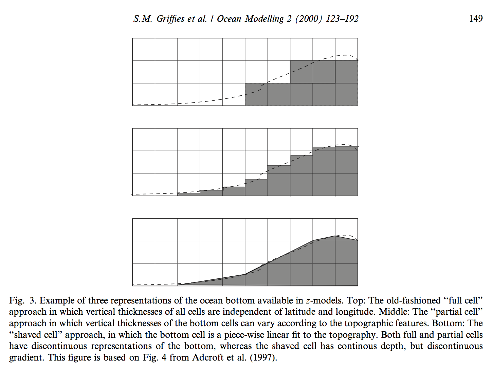

# Developments in ocean modelling $^1$

[1] Griffies SM, Böning C, Bryan FO, Chassignet EP, Gerdes R, Hasumi H, et al. Developments in ocean climate modelling. Ocean Modelling. 2000;2(3):123-92.

### 1. Overview
海洋模型主要问题包括

* 垂向坐标
* 水平坐标，水平网格，时间递进
* 正压动力系统
* surface mixed layer，（PBL or 大气边界层）
* z坐标研究底部地形进展
* overflow（密度驱动流）
* 状态方程
* 输运方程
* 动量方程离散
* 涡流运动参数化
* 高精度

###2. Vertical coordinates

---
### 4. Barotropic dynamics
外模（external mode）求解主要分为三种方法
1. A streamfunction method using rigid-lid approximation
2. Implicit free surface methods
3. Explicit free surface methods

其各自优缺点
**rigid lid streamfunction method**

* 需要求解椭圆方程
rigid lid streamfunction method 包含 Dirchlet边界条件的正压流函数椭圆方程，rigid lid pressure method则包含Neumann边界条件椭圆方程
许多随时间变化的外部力使椭圆方程求解时无法收敛；在地形有大梯度区域可能会有数值振荡情况；并行计算难度大
* 不能计算水体进入海洋
* 不能模拟潮流过程

**Implicit free surface methods**
使用隐式时间递进方法求解二维垂向积分动量方程，使动压项计算时间与斜压项计算时间匹配

* 因为引入数值抑制方法，不适合潮流模拟
也可以通过减小时间步的方法，但使其优势丧失
* 包含Neumann边界条件的椭圆问题
* 方法假设表面高度相对水深很小$\left| \eta \right|\le H$，对海岸区域模拟这个假设存在问题
* 使用z网格时假设顶层网格厚度比表面高度大$\left| \eta \right|\le \Delta z$，当网格在垂向进行细分后假设不成立

**Explicit free surface methods**

* Webb(1998a)，Griffies(2000b)提出对于z网格在某些情况下计算不稳定，通过时间平均方法修正了此问题
* 时间步根据正压重力波与斜压重力波速度确定

---
### 5. Surface mixed layer
表面混合层包括模拟：
1. 风驱动下对海表面搅动作用
2. 非稳定浮力
3. 非稳定表面切应力
4. 紊动对流
5. 非局部混合
6. 内部重力波破碎

模拟表面混合层主要分为两类：bulk mixed layer models & continuous models。
Bulk 模型假设表面混合层是完全紊动状态，所以速度与物质在混合层内都是均匀分布；continuous 模型允许垂向分布存在。
所有混合模型都是依据一维物理模型得到的。

**bulk model**
适用z坐标网格，对于$\rho$坐标需要进行修改，但是由于$\rho$坐标无法解析垂向结构，而且有些数值计算问题，此方法受到限制。

**continuous model**
1. 使用紊流闭合模型方法（MY-2.5），适合在切应力比较大或是紊动传输比较重要的区域。
2. K-profile（KPP），该混合格式考虑了所有重要的物理过程，包括非局部混合，并且适用于较粗的垂向网格中
$$\partial_{t} \Phi = \partial_{z}( k \partial_{z}\Phi -\gamma)$$
其中$\gamma$为非局部传输项，$k$是随时间变化的垂向扩散系数，在Richardson数较小的地方k较大。

---
### 6. Bottom topography
$\rho$ 与 $\sigma$ 坐标使用逐段线性方法（shaved cell）描述底部地形非常精确，而且没有底部和侧面边界之分。
z坐标分为三种方法：
1. full cell 原始格式
2. partical cell 部分网格格式
3. shaved cell 连续深度，梯度间断格式

---
### 7. Overflow representation
难点：
* 高密度水体在大陆架运动时动力系统复杂
* 穿过海脊等运动过程依赖于底部地形的精确描述
* 底部高密度流会对周围水体产生强烈夹带作用

目前研究主要问题

* 过去存在问题包括，使用z网格底部水体混合太强，而$\rho$网格混合太弱（夹带引起混合太少）
* 对z网格修正方法包括引入随地形变化的底部边界层，与混合网格方法类似，仍需注意水平梯度计算
* $\rho$网格引入隐式垂向混合方法，允许夹带引起垂向大量混合计算
* 描述底部边界层最自然的方法为$\sigma$网格配合紊流耦合模型，但是在水平分辨率较低的底部大梯度地形处，高分辨率的$\sigma$网格会产生较大的梯度计算误差
* 仍需要继续研究关于底部边界层（BBL）描述的方法

---
###8. Equation of state

* 使用z网格计算状态方程直接而且精确
* 使用$\rho$网格十分繁琐，目前找到一种容易处理的温压表示方法

---
### 9. Tracer transport in the ocean interior
由Ledwell(1993)、Duda(1995)、Kelley（1999）等人研究指出，在不受边界影响的海洋内部区域，跨密度混合扩散系数大约为0.1~0.2 cm2/s，而沿等密度面混合系数大约是其10^8倍。因此，计算物质输运的格式其数值耗散量不能超过0.1~0.2cm2/s

---
### 12. Horizontal momentum friction

**constatnt ciscosity friction**
引入常量形式物理扩散系数
**non-constant viscosity friction**
1. Form of the friction operator
取应力张量的离散协变散度作为切应力
2. A priori choices for the viscosity
由于高精度网格，在更小的粘性与更小的时间步之间选择
3. Smagorinsky viscosity
$$A_{smag}=(C\Delta/\pi)^2\left|D \right|$$
其中$D^2=D_T^2+D_S^2$，$D_T=u_x-v_y$为水平张量，$D_S=u_y+v_x$为水平切应力，系数C可由经验或网格精度确定

---
